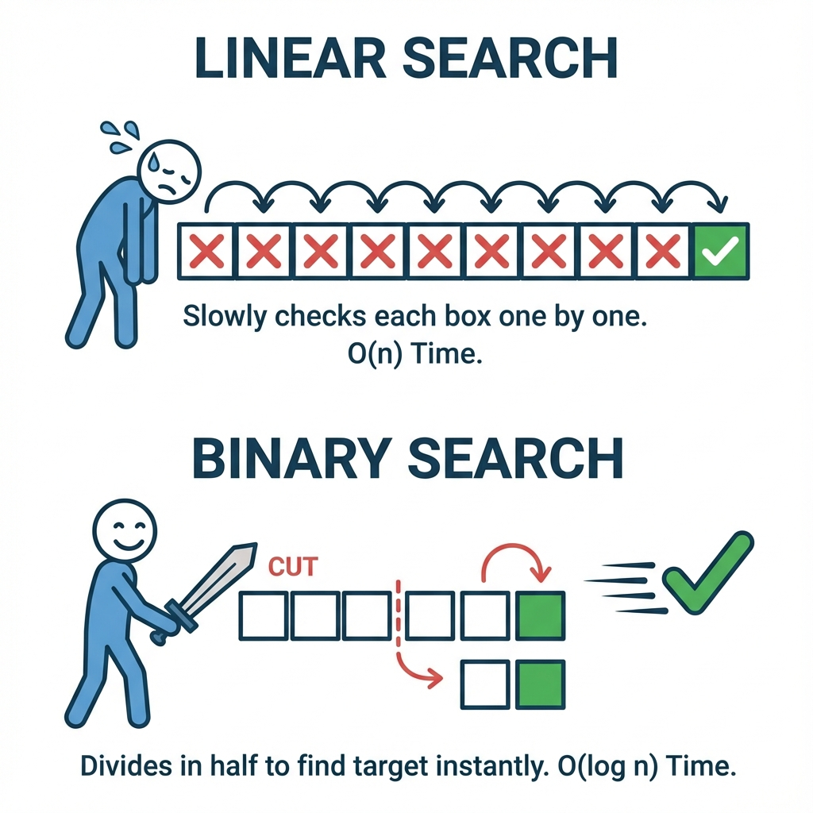

[← Back to Algorithms Index](algorithms.md)

# Chapter 1: Searching Algorithms (ရှာဖွေခြင်း Algorithms)

Information တိကို ရှာဖွေရာမှာ အသုံးပြုရေ အခြေခံ Algorithms တိကို လေ့လာကတ်ပါဖို့။

---

## 1. Linear Search (အစဉ်လိုက် ရှာဖွေခြင်း)



**ယင်းက ဇာလဲ?**
စာအုပ်ပုံထဲမှာ ကိုယ်လိုချင်ရေ စာအုပ်ကို မတွိ့မချင်း တစ်အုပ်ပြီးတစ်အုပ် လိုက်ရှာရေ နည်းလမ်းပါ။ ရှာစရာရှိစွာ အကုန်လုံးကို အစကနီ အဆုံးထိ တစ်ခုချင်းစီ လိုက်စစ်ဆေးပါရေ။

**လက်တွိ့ဘဝ ဥပမာ -**
အင်္ကျီဆိုင်မှာ ကိုယ်လိုချင်ရေ "အနီရောင်တီရှပ်" ကို ရှာရေအခါ၊ ချိတ်ထားရေ အင်္ကျီတိကို ထိပ်ဆုံးကနီစပြီး "ဒါလား? မဟုတ်ဘူး.. ဒါလား? မဟုတ်ဘူး" နန့် မတွိ့မချင်း လိုက်ကြည့်သပိုင်မျိုးပါ။

**ဇာပိုင် အလုပ်လုပ်သလဲ?**
1.  ပထမဆုံး တစ်ခုကို ယူကြည့်ပါ။
2.  ကိုယ်ရှာချင်စွာ ဟုတ်လား?
    *   **ဟုတ်ရေ** ဆိုကေ တွိ့ပြီ! (ပြီးပါပြီ)
    *   **မဟုတ်ဘူး** ဆိုကေ နောက်တစ်ခုကို ဆက်ကြည့်စမ်း။
3.  အကုန်ကုန်ရေအထိ မတွိ့ကေ "မရှိပါ" လို့ ပြန်ပြောပါ။

**Visualization:**
```text
Target: 30 (၃၀ ကို ရှာမေ)
[ 10 ] -> [ 50 ] -> [ 30 ] -> တွိ့ပြီ!
 စစ်မည်    စစ်မည်    စစ်မည်
```

**Pseudocode:**
```text
START
  FOR EACH Item IN List
    IF Item == Target THEN
      RETURN Index (Found)
    END IF
  END FOR
  RETURN -1 (Not Found)
END
```

---

## 2. Binary Search (ထက်ဝက်ခွဲ ရှာဖွေခြင်း)

**ယင်းက ဇာလဲ?**
ဒါကတော့ ပိုမြန်ရေ နည်းလမ်းပါ။ ဒါပေမဲ့ Data တိက **အစဉ်လိုက် စီထားပြီးသား (Sorted)** ဖြစ်မှ သုံးလို့ရပါဖို့။ ရှာရမယ့် အပိုင်းအခြားကို ထက်ဝက်စီ ချိုးပြီး ရှာစွာပါ။

**လက်တွိ့ဘဝ ဥပမာ -**
မိတ်ဆွေက ၁ ကနီ ၁၀၀ ကြား ဂဏန်းတစ်ခု စဉ်းစားထားပါ။ ကျွန်တော်က ၅၀ လို့ ခန့်မှန်းလိုက်မေ။
*   မိတ်ဆွေက "၅၀ ထက်ကြီးရေ" လို့ပြောကေ ၁-၅၀ ထိ ဂဏန်းတိကို ကျွန်တော် ထပ်ရှာစရာ မလိုတော့ပါ။ ၅၁-၁၀၀ ကြားကိုရာ ဆက်ရှာရတော့မေ။
*   ဒီပိုင်နည်းနန့် မလိုအပ်ရေ ထက်ဝက်ကို ဖယ်ထုတ်လိုက်စွာမို့ အရမ်းမြန်ပါရေ။

**ဇာပိုင် အလုပ်လုပ်သလဲ?**
1.  အလယ်တည့်တည့်က Data ကို ရွေးလိုက်ပါ။
2.  ကိုယ်ရှာချင်စွာနန့် တူလား?
    *   တူကေ တွိ့ပြီ!
    *   ကိုယ်ရှာချင်စွာက **ပိုကြီးနီကေ** ညာဘက်ခြမ်း (ဂဏန်းကြီးရေဘက်) ကို ဆက်ရှာပါ။
    *   ကိုယ်ရှာချင်စွာက **ပိုငယ်နီကေ** ဘယ်ဘက်ခြမ်း (ဂဏန်းငယ်ရေဘက်) ကို ဆက်ရှာပါ။
3.  မတွိ့မချင်း ထက်ဝက်စီ ခွဲပြီး ရှာသွားပါ။

**Pseudocode:**
```text
START
  Left = 0, Right = Length - 1
  WHILE Left <= Right
    Mid = (Left + Right) / 2
    IF Array[Mid] == Target THEN
      RETURN Mid (Found)
    ELSE IF Target < Array[Mid] THEN
      Right = Mid - 1
    ELSE
      Left = Mid + 1
    END IF
  END WHILE
  RETURN -1 (Not Found)
END
```


---

## သင်ခန်းစာ အကျဉ်းချုပ်
- **Linear Search**: တစ်ခုချင်းစီ လိုက်ရှာရေ နည်းလမ်း (နှေးရေ)။
- **Binary Search**: ထက်ဝက်စီ ခွဲရှာရေ နည်းလမ်း (မြန်ရေ၊ Data စီထားဖို့လိုရေ)။

## လေ့ကျင့်ခန်း (Exercises)
1. **Phone Book**: ဖုန်းစာအုပ်ထဲတွင် "Mg Mg" ဆိုသော အမည်ကို ရှာချင်သည်။ ဖုန်းစာအုပ်သည် အက္ခရာစဉ်အလိုက် စီထားလျှင် *Linear Search* သို့မဟုတ် *Binary Search* မည်သည်ကို သုံးသင့်သနည်း?
2. **Missing Sock**: အဝတ်ပုံထဲတွင် ပျောက်နေသော ခြေအိတ်တစ်ဖက်ကို ရှာချင်သည်။ ဤအခြေအနေသည် *Linear Search* နှင့် တူသလား၊ *Binary Search* နှင့် တူသလား?


[Next: Sorting Algorithms >](chapter_2_sorting.md)

[Back to Main Menu >](../menu.md)
