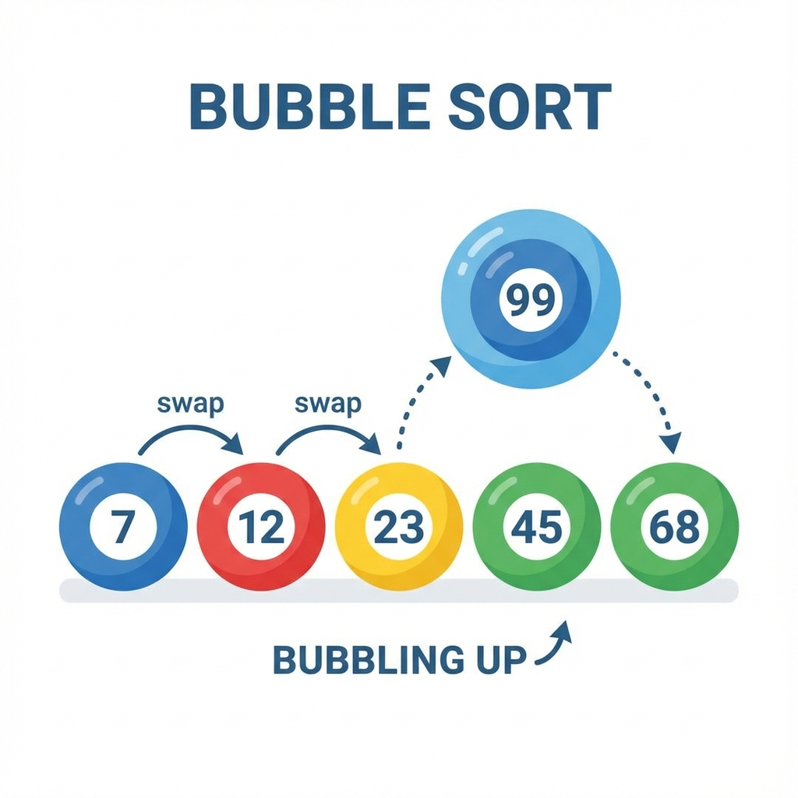
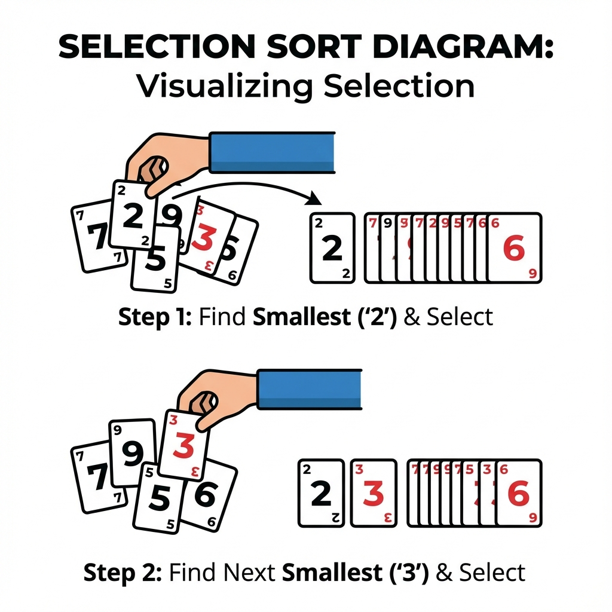
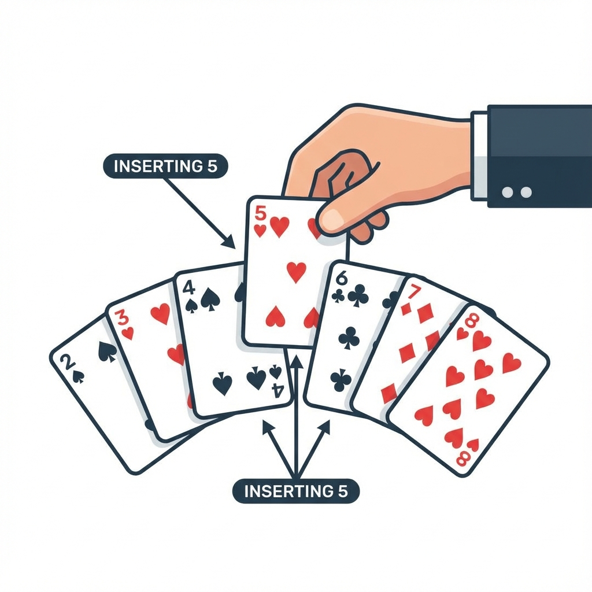
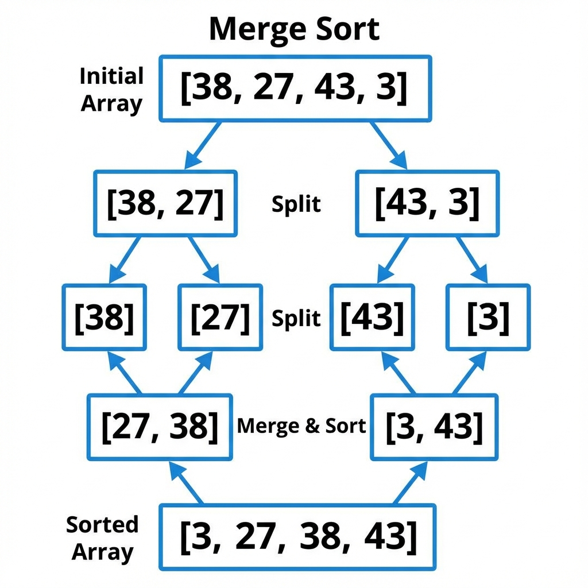
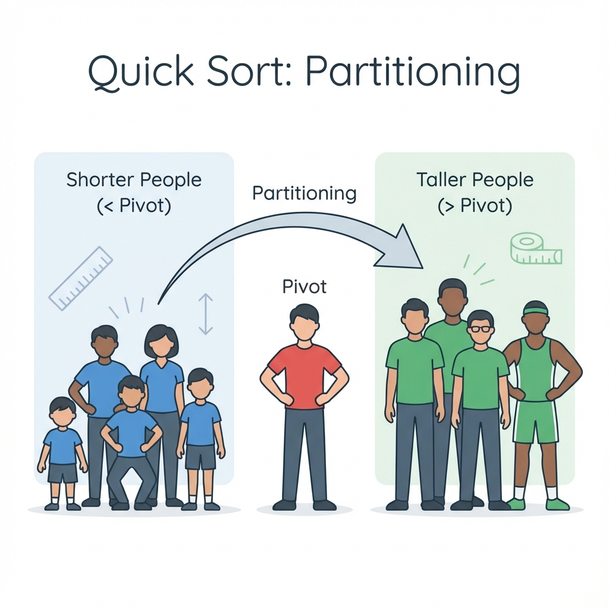

# Chapter 2: Sorting Algorithms (အစဉ်လိုက် စီခြင်း Algorithms)

အချက်အလက်တိကို စနစ်တကျ စီစီညီညီဖြစ်အောင် စီရေ Algorithms တိကို လေ့လာကတ်ပါဖို့။

---

## 1. Bubble Sort (ပူပေါင်းစီခြင်း)



**ယင်းက ဇာလဲ?**
အစီအစဉ်မကျရေ Data တိကို ငယ်စဉ်ကြီးလိုက် (သို့) ကြီးစဉ်ငယ်လိုက် စီချင်ရေအခါ သုံးပါရေ။ ကပ်လျက်နှစ်ခုကို ယှဉ်ကြည့်ပြီး နီရာမှားနီကေ ချိန်း (Swap) ပါရေ။

**လက်တွိ့ဘဝ ဥပမာ -**
ကျောင်းသားတိကို အရပ်အမြင့်အတိုင်း တန်းစီခိုင်းပိုင်ပါ။
ထိပ်ဆုံးက နှစ်ယောက်ကို ယှဉ်မေ။ ဘယ်ဘက်ကလူ ပိုရှည်နီကေ နီရာချိန်းမေ။ ပြီးကေ နောက်တစ်တွဲ ဆက်ယှဉ်မေ။ ယင့်ပိုင်နည်းနန့် အရပ်အရှည်ဆုံးလူက နောက်ဆုံး (ညာဘက်အစွန်) ကို အသာသာ ရောက်လားပါလိမ့်မေ။

**Pseudocode:**
```text
START
  REPEAT
    Swapped = False
    FOR i FROM 0 TO Length - 2
      IF Array[i] > Array[i+1] THEN
        Swap(Array[i], Array[i+1])
        Swapped = True
      END IF
    END FOR
  UNTIL Swapped == False
END
```

---

## 2. Selection Sort (ရွီးထုတ်စီခြင်း)



**ယင်းက ဇာလဲ?**
Data စီရေနည်းပါရာ။ သူကတော့ အားလုံးထဲမှာ **အငယ်ဆုံး** တစ်ခုကို ရှာပြီး ရှိဆုံးမှာ လာထားပါရေ။ ပြီးကေ ကျန်စွာထဲက အငယ်ဆုံးကို ထပ်ရှာပြီး ဒုတိယနီရာမှာ ထားပါရေ။

**လက်တွိ့ဘဝ ဥပမာ -**
ဖဲချပ်တိကို လက်ထဲမှာ ကိုင်ထားပြီး အငယ်ဆုံး (ဥပမာ - ၂) ကို ရှာပြီး ထိပ်ဆုံးမှာ ထုတ်ထားလိုက်ရေ။ ပြီးကေ ကျန်စွာထဲက အငယ်ဆုံး (ဥပမာ - ၃) ကို ရှာပြီး ၂ ရဲ့ဘေးမှာ ထပ်ထားပိုင်မျိုးပါ။

**Pseudocode:**
```text
START
  FOR i FROM 0 TO Length - 1
    MinIndex = i
    FOR j FROM i + 1 TO Length - 1
      IF Array[j] < Array[MinIndex] THEN
        MinIndex = j
      END IF
    END FOR
    Swap(Array[i], Array[MinIndex])
  END FOR
END
```

---

## 3. Insertion Sort (ထိုးထည့်စီခြင်း)



**ယင်းက ဇာလဲ?**
Data တစ်ခုချင်းစီကို ယူပြီး သူ့နီရာအမှန်မှာ လိုက်ထည့်ရေ နည်းလမ်းပါ။

**လက်တွိ့ဘဝ ဥပမာ -**
ဖဲကစပ်ရေအခါ ဖဲချပ်အသစ်တစ်ချပ် ဆွဲလိုက်တိုင်း လက်ထဲမှာရှိပြီးသား ဖဲချပ်တိကြားထဲက နီရာမှန် (ဥပမာ - ၅ နန့် ၇ ကြားမှာ ၆ ကို ထိုးထည့်) မှာ ထည့်လိုက်သပိုင်မျိုးပါ။

**Pseudocode:**
```text
START
  FOR i FROM 1 TO Length - 1
    Key = Array[i]
    j = i - 1
    WHILE j >= 0 AND Array[j] > Key
      Array[j + 1] = Array[j]
      j = j - 1
    END WHILE
    Array[j + 1] = Key
  END FOR
END
```

---

## 4. Merge Sort (ပေါင်းစည်းစီခြင်း)



**ယင်းက ဇာလဲ?**
Data တိအများကြီးကို တစ်ခါတည်း စီဖို့အစား၊ အရင်ဆုံး တစ်ဝက်စီ ခွဲထုတ်လိုက်ပါရေ။ တစ်ယောက်တစ်ဝက် စီပြီးမှ ပြန်ပေါင်း (Merge) ရေ နည်းလမ်းပါ။

**လက်တွိ့ဘဝ ဥပမာ -**
စာမေးပွဲအဖြေလွှာ အုပ်ကြီးတစ်ခုလုံးကို ဆရာတစ်ယောက်တည်း စီကေကြာလို့ နှစ်ပုံခွဲပြီး ဆရာနှစ်ယောက်ကို စီခိုင်းလိုက်ရေ။ ပြီးမှ ဆရာနှစ်ယောက် ပြန်ပီးလာရေ အစီအစဉ်ကျပြီးသား စာရွက်နှစ်ပုံကို ပေါင်းလိုက်စွာပါ။

**Pseudocode:**
```text
FUNCTION MergeSort(List)
  IF Length of List <= 1 THEN
    RETURN List
  END IF
  Mid = Length / 2
  Left = MergeSort(List[0...Mid])
  Right = MergeSort(List[Mid...End])
  RETURN Merge(Left, Right)
END FUNCTION
```

---

## 5. Quick Sort (အမြန်စီခြင်း)



**ယင်းက ဇာလဲ?**
Data တစ်ခု (Pivot) ကို ရွီးလိုက်ပြီး၊ သူ့ထက်ငယ်စွာတိကို ဘယ်ဘက်၊ ကြီးစွာတိကို ညာဘက် ပို့လိုက်ရေ နည်းလမ်းပါ။

**လက်တွိ့ဘဝ ဥပမာ -**
အားကစားကွင်းမှာ ကျောင်းသားတိကို ခွဲရေအခါ "မောင်မောင် (Pivot) ထက် အရပ်ပုရေလူတိ ဘယ်ဘက်လား၊ ရှည်ရေလူတိ ညာဘက်လား" လို့ အုပ်စုခွဲလိုက်သပိုင်ပါရာ။ ပြီးမှ ယင့်အုပ်စုတိကို ထပ်ပြီး ခွဲလားစွာပါ။

**Pseudocode:**
```text
FUNCTION QuickSort(List)
  IF Length of List <= 1 THEN
    RETURN List
  END IF
  Pivot = SelectPivot(List)
  Left = Elements < Pivot
  Right = Elements > Pivot
  RETURN QuickSort(Left) + [Pivot] + QuickSort(Right)
END FUNCTION
```


---

## သင်ခန်းစာ အကျဉ်းချုပ်
- **Bubble Sort**: ဘေးချင်းယှဉ်ပြီး ချိန်းရေနည်း။
- **Selection Sort**: အငယ်ဆုံးကို ရွီးထုတ်ရေနည်း။
- **Merge Sort**: ခွဲထုတ်ပြီးမှ ပြန်ပေါင်းစီရေနည်း။

## လေ့ကျင့်ခန်း (Exercises)
1. **Card Game**: ဖဲချပ်တိကို လက်ထဲတွင် ကိုင်ထားပြီး ငယ်စဉ်ကြီးလိုက် စီချင်သည်။ ဖဲချပ်အသစ်တစ်ချပ် ဆွဲတိုင်း နေရာမှန်တွင် ထိုးထည့်လိုက်ခြင်းသည် မည်သည့် Sorting Algorithm နှင့် တူသနည်း?
2. **School Assembly**: ကျောင်းသားတိကို အရပ်အမြင့်အလိုက် တန်းစီခိုင်းသည်။ ဘေးချင်းယှဉ်ရပ်နီရေ ကျောင်းသားနှစ်ဦးကို ကြည့်ပြီး အရပ်ရှည်သူကို နောက်ပို့ရေနည်းလမ်းရေ ဇာ Algorithm လဲ?

 
