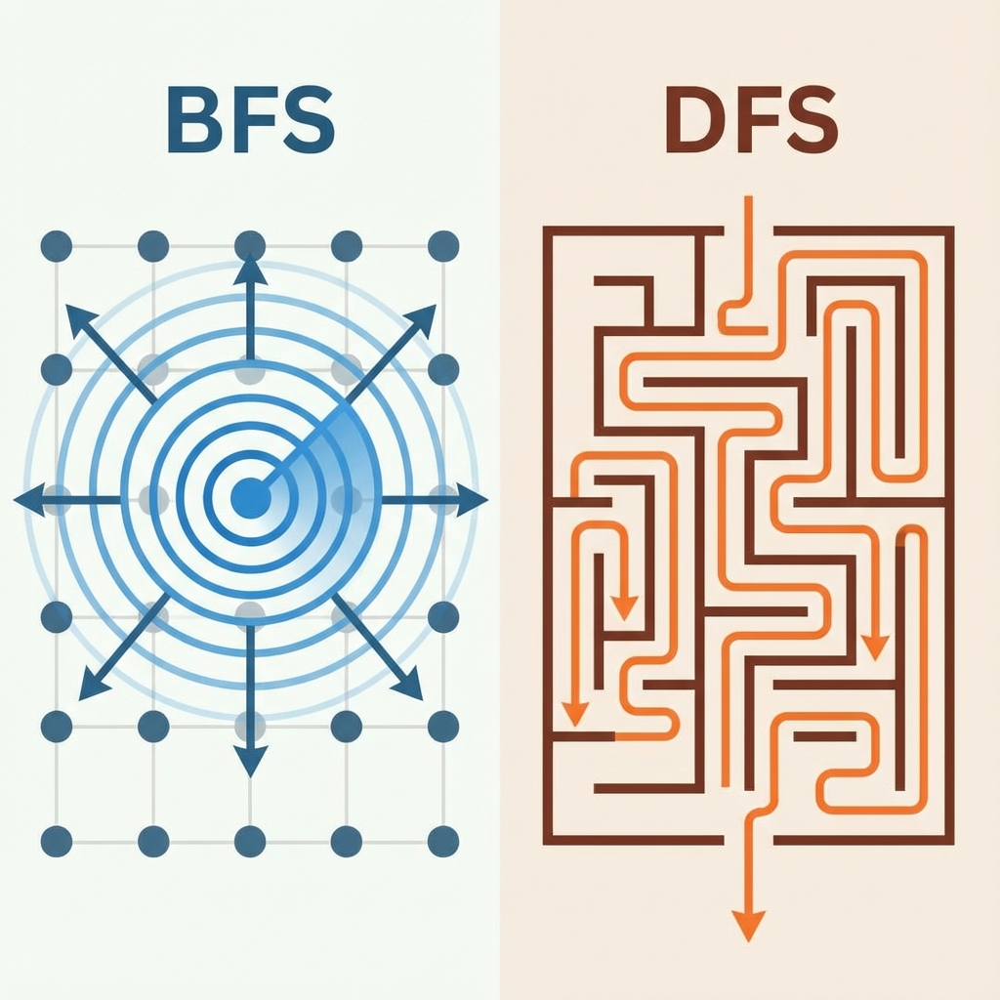
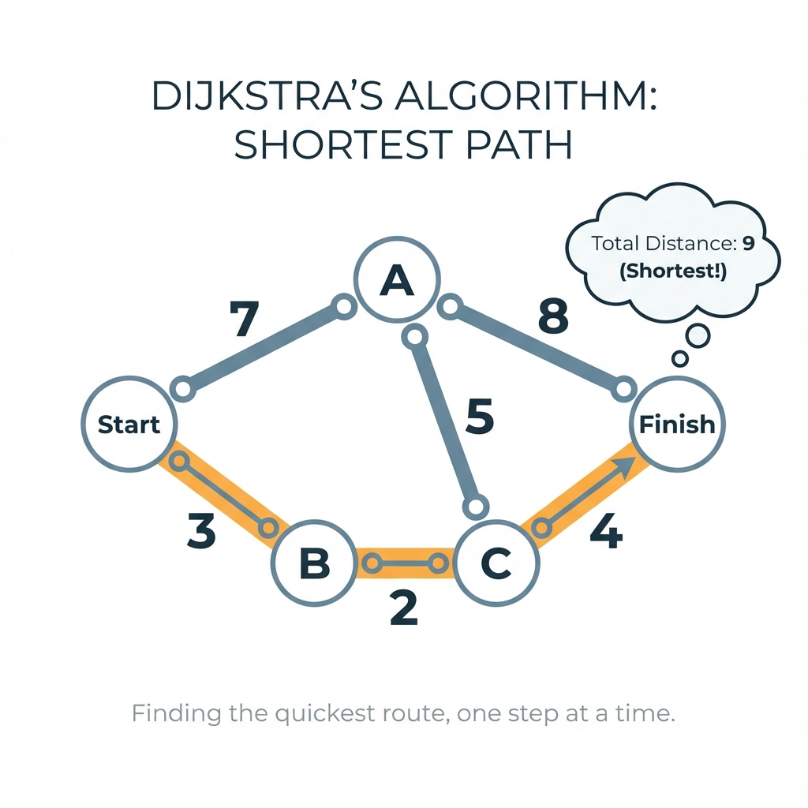

# Chapter 3: Graph Algorithms (ကွန်ရက် ရှာဖွီခြင်း Algorithms)

Algorithm လောကမှာ အရေးအကြီးဆုံးဖြစ်ရေ Graph (ကွန်ရက်) တိကို ဇာပိုင် ရှာဖွီလဲ၊ အတိုဆုံးလမ်းကြောင်း ဇာပိုင်ရှာလဲ ဆိုစွာကို လေ့လာကတ်ပါဖို့။

---

## 1. Breadth-First Search (BFS - ရီပြင်ညီ ရှာဖွီခြင်း)



**ယင်းက ဇာလဲ?**
နီရာတစ်ခုကနီ စပြီး ကိုယ်နန့် အနီးဆုံးနီရာတိကို အရင်လိုက်ရှာရေ နည်းလမ်းပါ။

**လက်တွိ့ဘဝ ဥပမာ -**
ရီကန်ထဲ ကျောက်ခဲပစ်ချလိုက်ကေ လှိုင်းတိက အလယ်ကနီ ဘေးကို အသာသာ ပြန့်ပိုင်မျိုးပါ။ ကိုယ်နန့် အနီးဆုံး သူငယ်ချင်းတိကို အရင်ရှာ၊ ပြီးမှ သူရို့ သူငယ်ချင်းတိကို ဆက်ရှာစွာမျိုး (Facebook Friends) ပိုင်။

**Pseudocode:**
```text
START
  Queue.Enqueue(StartNode)
  Mark StartNode as Visited
  WHILE Queue is NOT Empty
    Node = Queue.Dequeue()
    Process(Node)
    FOR EACH Neighbor of Node
      IF Neighbor is NOT Visited THEN
        Mark Neighbor as Visited
        Queue.Enqueue(Neighbor)
      END IF
    END FOR
  END WHILE
END
```

---

## 2. Depth-First Search (DFS - ဒေါင်လိုက် ရှာဖွီခြင်း)

**ယင်းက ဇာလဲ?**
လမ်းတစ်ခုကို ရွီးပြီးကေ ယင့်လမ်းအတိုင်း မဆုံးမချင်း (သို့) လမ်းပိတ်ရေအထိ ဆက်လားပြီးမှ နောက်ပြန်လှည့်ရေ နည်းလမ်းပါ။

**လက်တွိ့ဘဝ ဥပမာ -**
ဝင်္ကပါ (Maze) ထဲက ထွက်ပေါက်ရှာပိုင်ပါရာ။ လမ်းတစ်ခုတွိ့ကေ ဝင်လားဖို့။ လမ်းပိတ်နီကေ ပြန်လှည့်လာ၊ နောက်လမ်းတစ်ခုကို ဆက်စမ်းမေ။

**Pseudocode:**
```text
FUNCTION DFS(Node)
  Mark Node as Visited
  Process(Node)
  FOR EACH Neighbor of Node
    IF Neighbor is NOT Visited THEN
      DFS(Neighbor)
    END IF
  END FOR
END FUNCTION
```

---

## 3. Dijkstra's Algorithm (အတိုဆုံးလမ်းကြောင်း ရှာဖွီခြင်း)



**ယင်းက ဇာလဲ?**
နီရာနှစ်ခုကြား လားလို့ရရေ လမ်းတိအများကြီးထဲကနီ အချိန်အနည်းဆုံး၊ သို့ ခရီးအနီးဆုံး လမ်းကို တွက်ချက်ပီးစွာပါ။

**လက်တွိ့ဘဝ ဥပမာ -**
**Google Maps** ပါရာ။ အိမ်ကနီ ရုံးကိုလားဖို့ လမ်းတိအများကြီးရှိကေလည်း၊ ယင့် Algorithm က ကားပိတ်ရေလမ်း၊ ဝီးရေလမ်းတိကို ရှောင်ပြီး အယင်ဆုံးရောက်ဖို့ လမ်းကြောင်းကို တွက်ပီးစွာဖြစ်ပါရေ။

**Pseudocode:**
```text
START
  Init Distances to Infinity, StartNode to 0
  PriorityQueue.Add(StartNode, 0)
  WHILE PriorityQueue is NOT Empty
    CurrentNode = PriorityQueue.PopMin()
    FOR EACH Neighbor of CurrentNode
      NewDist = Distances[CurrentNode] + EdgeWeight
      IF NewDist < Distances[Neighbor] THEN
        Distances[Neighbor] = NewDist
        PriorityQueue.Update(Neighbor, NewDist)
      END IF
    END FOR
  END WHILE
END
```


---

## သင်ခန်းစာ အကျဉ်းချုပ်
- **BFS**: ရီပြင်ညီ ရှာဖွီခြင်း (အပါးဆုံးက အရင်)။
- **DFS**: ဒေါင်လိုက် ရှာဖွီခြင်း (အဆုံးထိလားပြီးမှ ပြန်လှည့်)။
- **Dijkstra**: အတိုဆုံး လမ်းကြောင်း ရှာဖွီခြင်း။

## လေ့ကျင့်ခန်း (Exercises)
1. **Shortest Path**: သံတွဲက ပုဏ္ဏားကျွန်းသို့ ခရီးစရိတ် အနည်းဆုံး (သို့) အချိန်အနည်းဆုံးဖြင့် လားလိုရေ။ Google Maps ကဲ့သို့သော စနစ်တိရေ ဇာ Graph Algorithm ကို အသုံးပြုဖို့ ထင်ပါလဲ?
2. **Maze Solver**: ဝင်္ကပါထဲမှ ထွက်ပေါက်ရှာစာမာ လမ်းဆုံးရေအထိ ဆက်လားပြီးမှ ပြန်လှည့်စာရေ *BFS* လား၊ *DFS* လား?


 
