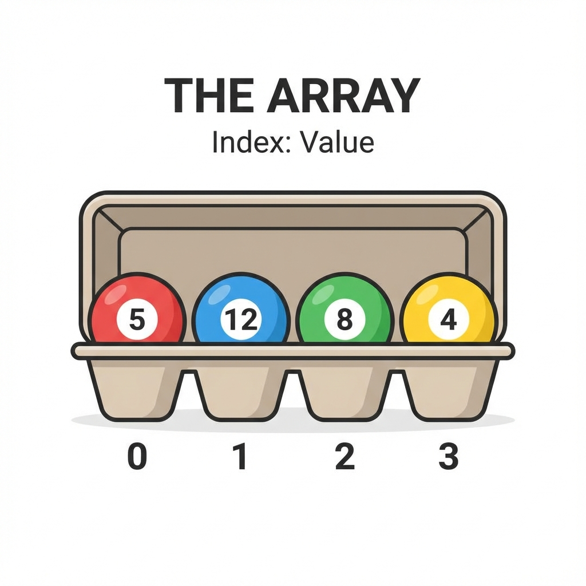
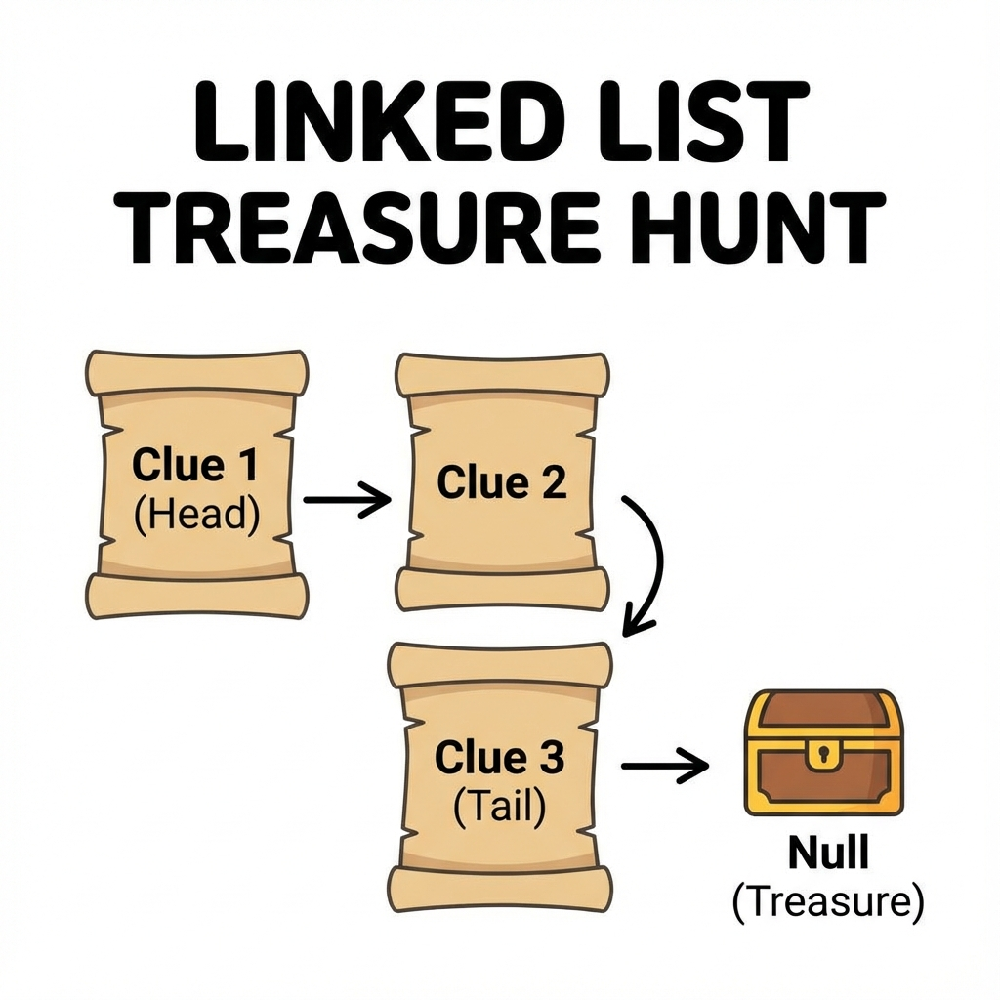
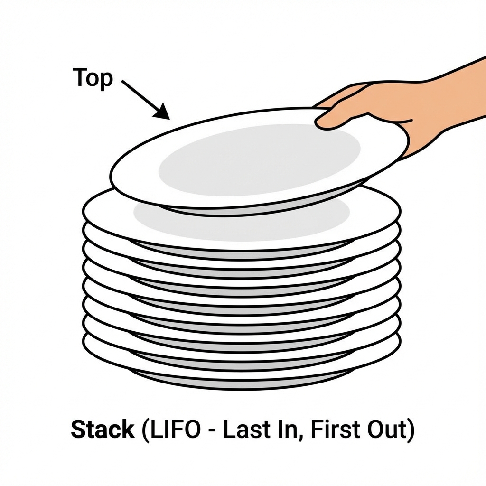
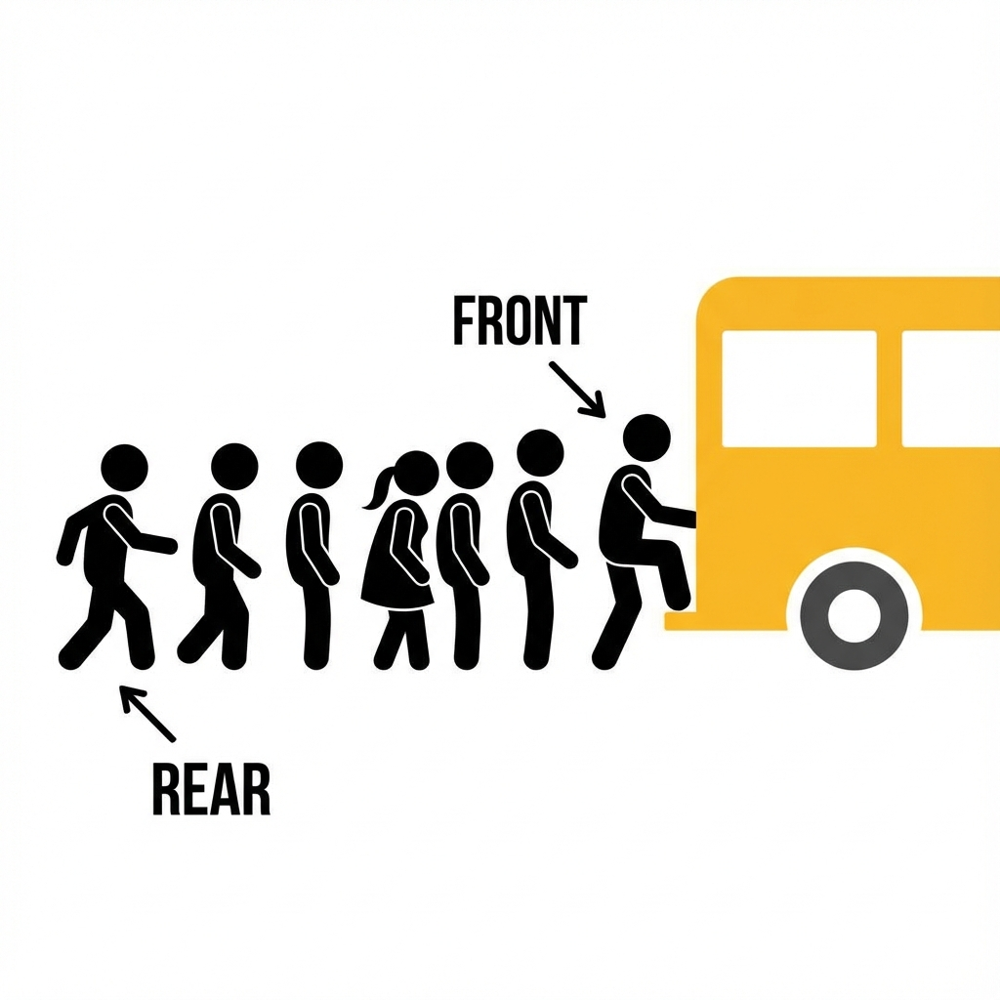

[← Back to Data Structures Index](data-structure.md)

# Chapter 1: Linear Data Structures (အစဉ်လိုက် အချက်အလက် တည်ဆောက်ပုံများ)

အချက်အလက်တိကို တစ်ခုပြီးတစ်ခု အစဉ်လိုက် သိမ်းဆည်းရေ Data Structure တိကို လေ့လာကတ်ပါဖို့။

---

## 1. Array (အစဉ်လိုက် စီထားရေ ဇယား)



**ယင်းက ဇာလဲ?**
အရွယ်အစား သတ်မှတ်ထားပြီးသား အခန်းကန့်ချေတိမှာ Data တိကို တစ်ခုပြီးတစ်ခု အစဉ်လိုက် ထည့်ထားရေ ပုံစံပါ။

**လက်တွိ့ဘဝ ဥပမာ -**
**ကြက်ဥကပ် (Egg Carton)** ပိုင်ပါရာ။ ကြက်ဥကပ်တစ်ခုမှာ အလုံး ၃၀ ဆံ့ရေဆိုကေ ၃၀ ရာ ထည့်လို့ရဖို့။ ၃၁ လုံးမြောက် ထပ်ထည့်ချင်ကေ ကပ်အသစ် လိုပါလိမ့်မေ။ ၅ လုံးမြောက် ကြက်ဥကို ယူချင်ကေ တန်းပနာ ယူလိုက်ရုံပါရာ။

**ဇာခါ သုံးဖို့လဲ?**
*   သိမ်းရဖို့ အရွီအတွက်ကို ကြိုသိထားရေ အခါ။
*   Data တိကို နံပါတ်စဉ် (Index) နန့် အမြန်ဆုံး ယူချင်ရေ အခါ။

**Visualization:**
```text
Index:  0    1    2    3    4
Data: [ 10 | 20 | 30 | 40 | 50 ]
```

---

## 2. Linked List (ကွင်းဆက် ဇယား)



**ယင်းက ဇာလဲ?**
Data တစ်ခုနန့် တစ်ခု လက်တွဲပနာ ချိတ်ထားရေ ပုံစံပါ။ Data တစ်ခုစီမှာ သူ့နောက်က Data ဇာနားမှာ ရှိရေလဲဆိုစွာ လိပ်စာ (Pointer) ပါပါရေ။

**လက်တွိ့ဘဝ ဥပမာ -**
**ရတနာသိုက် လမ်းညွှန်** ပိုင်ပါရာ။ ပထမ သဲလွန်စကို တွိ့မှ ဒုတိယ သဲလွန်စ ရှိရေနီရာကို သိရဖို့။ ဒုတိယကို ရမှ တတိယကို ဆက်သွားလို့ရဖို့။ ချက်ချင်းကြီး ပဉ္စမမြောက်နီရာကို ရောက်မသွားနိုင်ပါ။

**ဇာခါ သုံးဖို့လဲ?**
*   Data အရွီအတွက် အတိအကျ မသိရေ အခါ (လိုသလောက် ထပ်ချိတ်လားလို့ရရေ)။
*   ကြားထဲက Data တိကို ဖျက်စွာ၊ ထပ်ထည့်စွာ မကြာမကြ လုပ်ရရေ အခါ။

**Visualization:**
```text
[Head] -> [Data|Next] -> [Data|Next] -> null
```

---

## 3. Stack (ထပ်စီ - နောက်ဆုံးဝင် ပထမထွက်)



**ယင်းက ဇာလဲ?**
LIFO (Last In, First Out) ပုံစံပါ။ နောက်ဆုံးမှ ရောက်လာရေ အရာက အရင်ဆုံး ပြန်ထွက်ရပါရေ။

**လက်တွိ့ဘဝ ဥပမာ -**
**ပန်းကန်ပြား ဆီးပြီး ထပ်ထားစွာ** မျိုးပါ။ ဆီးပြီးသား ပန်းကန်တိကို တစ်ချပ်ပြီး တစ်ချပ် ထပ်လိုက်မေ။ ပြန်ယူသုံးရေ အခါ ထိပ်ဆုံး (နောက်ဆုံးမှထားရေ) ပန်းကန်ကိုရာ အရင်ယူလို့ ရပါဖို့။

**ဇာခါ သုံးဖို့လဲ?**
*   Undo (Ctrl+Z) လုပ်ဆောင်ချက် (နောက်ဆုံးမှားစွာကို အရင်ဖျက်စွာ)။
*   Web Browser ရဲ့ Back Button (နောက်ဆုံးကြည့်ထားရေ စာမျက်နှာကို ပြန်ခေါ်စွာ)။

**Visualization:**
```text
|  Top  |
|_______|
```

---

## 4. Queue (တန်းစီ - ဦးသူ ပထမထွက်)



**ယင်းက ဇာလဲ?**
FIFO (First In, First Out) ပုံစံပါ။ အရင်ဆုံး ရောက်ရေလူက အရင်ဆုံး ဝန်ဆောင်မှု ရပါရေ။

**လက်တွိ့ဘဝ ဥပမာ -**
**ဘတ်စ်ကားမှတ်တိုင်မှာ တန်းစီစွာ** မျိုးပါ။ အရင်ရောက်ရေလူ အရင်ကားထက်တက်ရရေ။ နောက်မှ ရောက်ရေလူက အနောက်ဆုံးမှာ နီရရေ။

**ဇာခါ သုံးဖို့လဲ?**
*   Printer မှာ စာရွက်ထုတ်ဖို့ စောင့်စွာ (အရင်ပို့ရေ ဖိုင် အရင်ထွက်ဖို့)။
*   Customer Service မှာ ဖုန်းပြောဖို့ စောင့်စွာ။

**Visualization:**
```text
Rear -> [ C ] -> [ B ] -> [ A ] -> Front
```


---

## သင်ခန်းစာ အကျဉ်းချုပ်
- **Array**: အရွယ်အစား သတ်မှတ်ထားရေ အစဉ်လိုက် ဇယား။
- **Linked List**: တစ်ခုနန့် တစ်ခု ချိတ်ဆက်ထားရေ ကွင်းဆက်။
- **Stack**: နောက်ဆုံးဝင် ပထမထွက် (LIFO)။
- **Queue**: ဦးသူ ပထမထွက် (FIFO)။

## လေ့ကျင့်ခန်း (Exercises)
1. **Music Playlist**: မင်းရေ MP3 App တစ်ခု ရွီးနီရေ ဆိုပါစို့။ "Next Song" နှင့် "Previous Song" ကို လွယ်လွယ်ကူကူ လားနိုင်ရန် *Array* နှင့် *Linked List* မည်သည်ကို ရွီးချယ်ဖို့လဲ? ဇာကြောင့်လဲ?
2. **Browser History**: Web Browser ၏ "Back" ခလုတ်ကို ဖိလိုက်ကေ နောက်ဆုံးကြည့်ထားရေ စာမျက်နှာကို ပြန်ရောက်လားရေ။ အေစနစ်အတွက် *Stack* သို့မဟုတ် *Queue* မည်သည်ကို သုံးသင့်လဲ?


[Next: Non-Linear Data Structures >](chapter_2_non_linear.md)

[Back to Main Menu >](../README.md)
