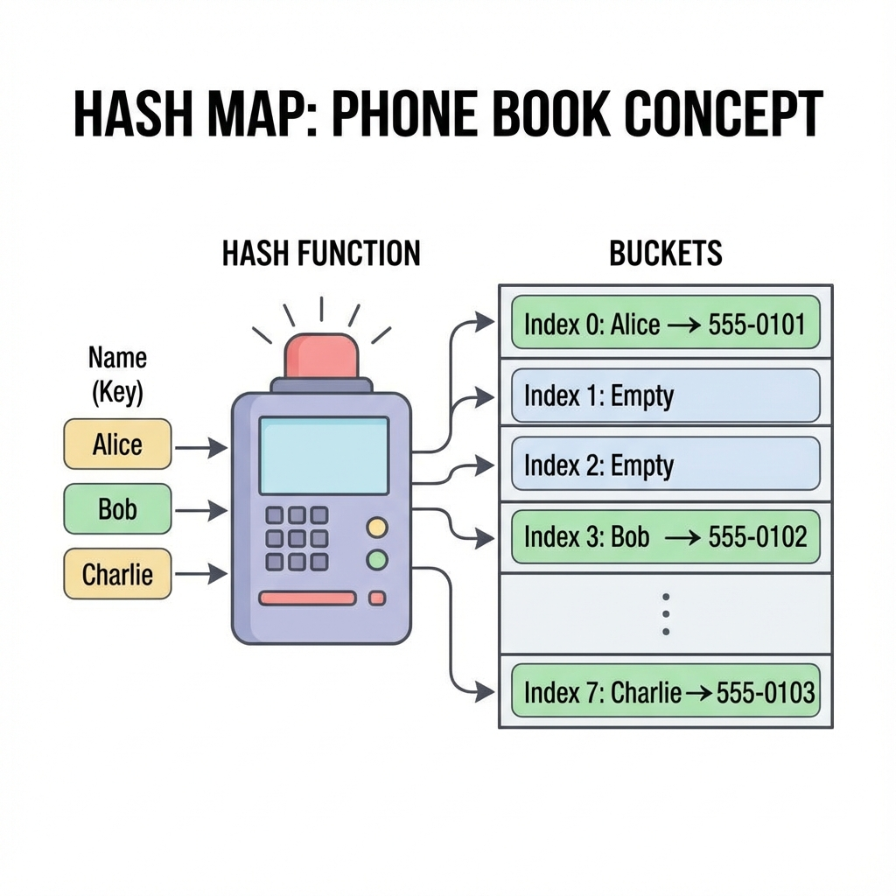
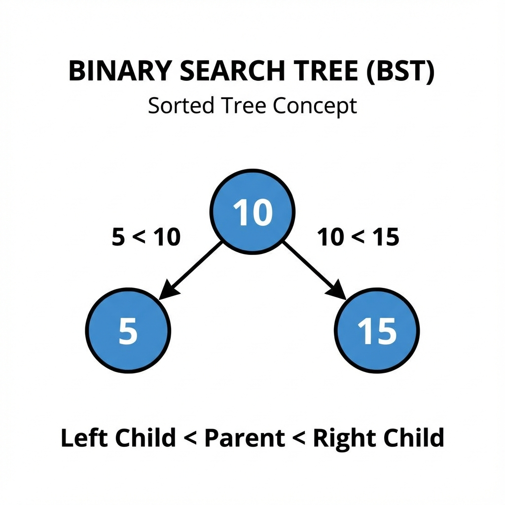
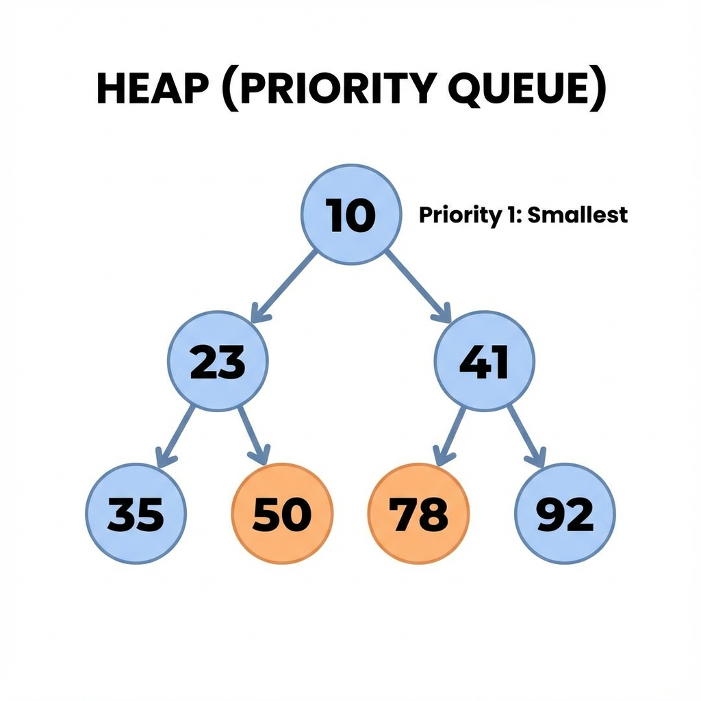
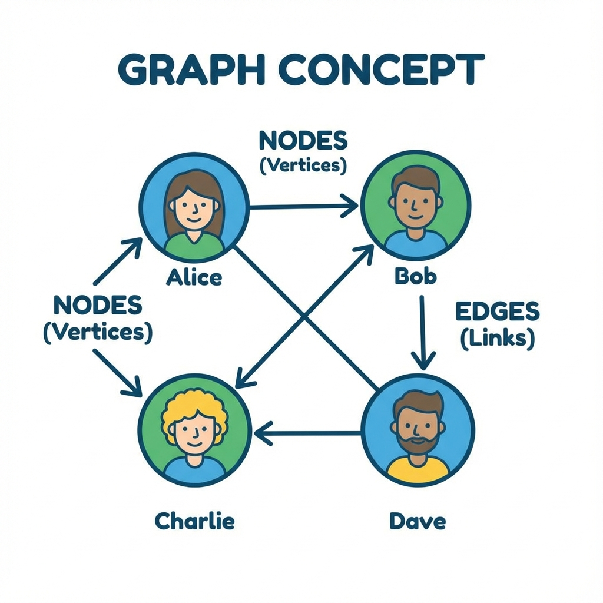
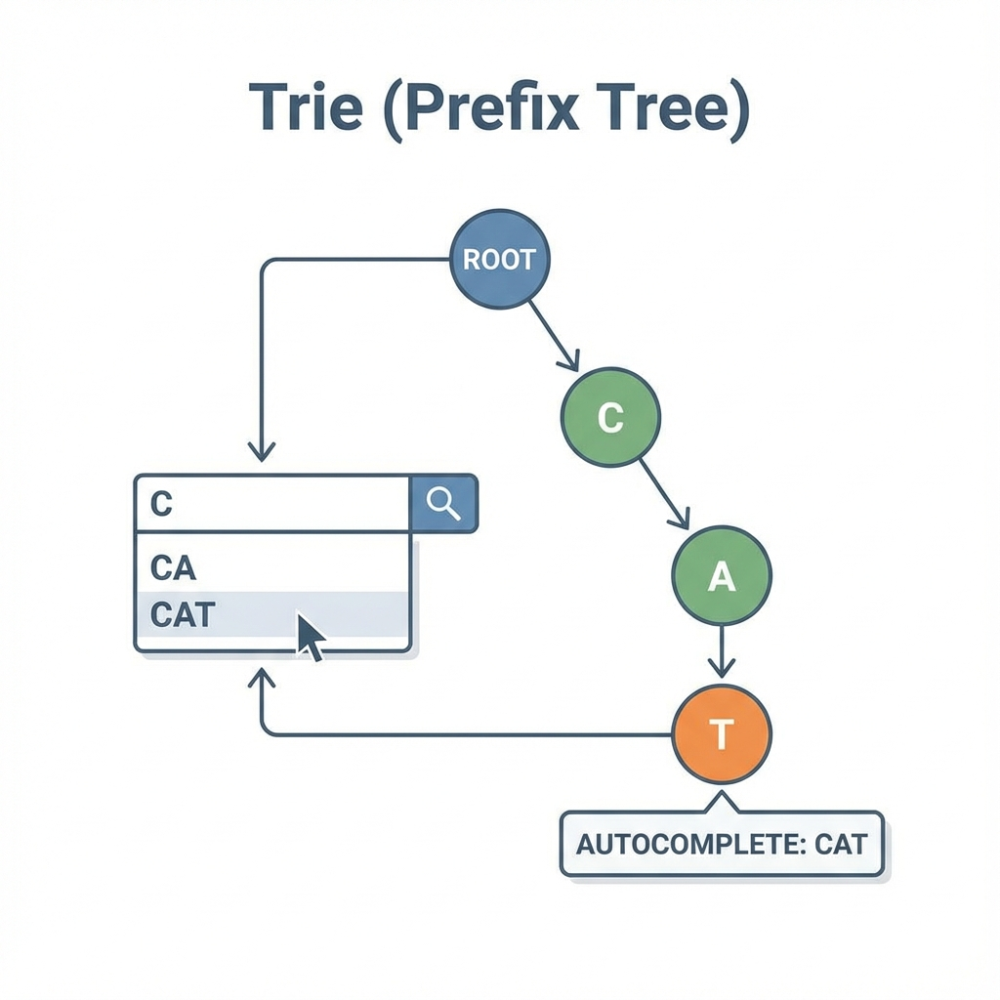

# Chapter 2: Non-Linear Data Structures (ကွန်ရက်ပုံစံ အချက်အလက် တည်ဆောက်ပုံများ)

အချက်အလက်တိကို ရှုပ်ထွီးရေ ချိတ်ဆက်မှုတိနန့် သိမ်းဆည်းရေ Data Structure တိကို လေ့လာကတ်ပါဖို့။

---

## 1. Hash Map (သော့ချိတ် ဇယား)



**ယင်းက ဇာလဲ?**
Key (သော့) နန့် Value (တန်ဖိုး) တွဲပနာ သိမ်းရေ ပုံစံပါ။ Key ကို သိစွာနန့် Value ကို ချက်ချင်း ရှာတွိ့နိုင်ပါရေ။

**လက်တွိ့ဘဝ ဥပမာ -**
**ဖုန်းစာအုပ် (Contacts)** ပိုင်ပါရာ။ "မောင်မောင်" (Key) ဆိုရေ နာမည်ကို ရှာလိုက်စွာနန့် သူ့ဖုန်းနံပါတ် (Value) ကို တန်းတွိ့ပါရေ။ တစ်ရွက်ချင်းစီ လှန်ရှာစရာ မလိုပါ။

**ဇာခါ သုံးဖို့လဲ?**
*   Data တိကို အမြန်ဆုံး ရှာဖွေချင်ရေ အခါ။
*   Password တိ၊ Username တိ စစ်ဆေးရေ အခါ။

**Visualization:**
```text
Key "John" -> Hash() -> Index 0 -> [ "John": 25 ]
Key "Jane" -> Hash() -> Index 1 -> [ "Jane": 30 ]
```

---

## 2. Binary Search Tree (သစ်ပင်ပုံစံ)



**ယင်းက ဇာလဲ?**
Data တိကို အဆင့်ဆင့် ခွဲပနာ သိမ်းရေ ပုံစံပါ။ ဘယ်ဘက် အကိုင်းမှာ ငယ်ရေ ဂဏန်း၊ ညာဘက် အကိုင်းမှာ ကြီးရေ ဂဏန်း ဆိုပနာ စည်းကမ်းနန့် သိမ်းပါရေ။

**လက်တွိ့ဘဝ ဥပမာ -**
**ဆုံးဖြတ်ချက်ချရေ ပုံစံ (Decision Tree)** ပိုင်ပါရာ။ မေးခွန်းတစ်ခုမေးမေ "ဟုတ်/မဟုတ်" ဖြေမေ။ အဖြေပေါ်မူတည်ပနာ နောက်တဆင့် ထပ်လားပိုင်ပါရာ။

**ဇာခါ သုံးဖို့လဲ?**
*   Data တိကို စီထားရေ အတိုင်း လိုချင်ရေ အခါ။
*   ရှာဖွီစွာ မြန်ချင်ရေ အခါ (Linked List ထက် ပိုယင်ရေ)။

**Visualization:**
```text
      10
     /  \
    5    15
```

---

## 3. Heap (ဦးစားပီး အစီအစိုင်)



**ယင်းက ဇာလဲ?**
အရေးကြီးဆုံး (သို့) အငယ်ဆုံး/အကြီးဆုံး Data ကို ထိပ်ဆုံးမှာ အမြဲထားရေ ပုံစံပါ။

**လက်တွိ့ဘဝ ဥပမာ -**
**ဆီးရုံ အရေးပေါ်ဌာန** ပိုင်ပါရာ။ ဇာလူအရင်ရောက်ရောက်၊ အသည်းအသန် ဖြစ်နီရေ လူနာ (Priority High) ကို ဆရာဝန်က အရင်ကုပေးသပိုင်မျိုးပါ။

**ဇာခါ သုံးဖို့လဲ?**
*   အလုပ်တိကို ဦးစားပီး အဆင့်နန့် လုပ်ဆောင်ချင်ရေ အခါ။
*   Google Maps မှာ အတိုဆုံး လမ်းကြောင်း ရှာရေ အခါ (အကွာအဝီး အနည်းဆုံးလမ်းကို ဦးစားပီး ရှာစွာ)။

**Visualization (Min-Heap):**
```text
       10 (Smallest)
     /    \
    20     30
```

---

## 4. Graph (ကွန်ရက်)



**ယင်းက ဇာလဲ?**
Data တိ တစ်ခုနန့် တစ်ခု ဇာပိုင် ပတ်သက်ဆက်နွယ်နီလဲ ဆိုစွာကို ပြရေ ကွန်ရက်ကြီးပါ။

**လက်တွိ့ဘဝ ဥပမာ -**
**Facebook Friends** ပိုင်ပါရာ။ ကိုယ်နန့် သူငယ်ချင်းတိ ချိတ်ဆက်နီရေ။ သူတို့ကလည်း တခြားလူတိနန့် ထပ်ချိတ်ဆက်နီရေ။
**မြေပုံ** ပိုင်မျိုးလည်း မြင်နိုင်ပါရေ။ မြို့တိက Data ဆိုကေ လမ်းတိက ချိတ်ဆက်မှု (Edge) တိပါ။

**ဇာခါ သုံးဖို့လဲ?**
*   GPS လမ်းကြောင်း ရှာရေ အခါ။
*   လူမှုကွန်ရက် (Social Network) တိ တည်ဆောက်ရေ အခါ။

**Visualization:**
```text
(A) -- (B)
 |      |
(D) -- (E)
```

---

## 5. Trie (စာလုံးစစ် သစ်ပင်)



**ယင်းက ဇာလဲ?**
စာလုံးတိကို ရှိစကားလုံး (Prefix) တူစာချင်း စုပနာ သိမ်းရေ ပုံစံပါ။

**လက်တွိ့ဘဝ ဥပမာ -**
**Google မှာ စာရိုက်ရှာစွာ (Autocomplete)** မျိုးပါ။ "Alg" လို့ ရိုက်လိုက်စွာနန့် "Algorithm", "Algebra" စသဖြင့် "Alg" နန့် စရေ စကားလုံးတိကို အကြံပီးပိုင်မျိုးပါ။

**ဇာခါ သုံးဖို့လဲ?**
*   စာလုံးပေါင်း စစ်ရေ အခါ (Spell Checker)။
*   ရှာဖွေရီး စနစ်တိမှာ စာလုံး ဖြည့်စွက်ပီးချင်ရေ အခါ (Auto-complete)။

**Visualization:**
```text
Root -> [C] -> [A] -> [T] (End)
            -> [R] -> [R] (End)
```


---

## သင်ခန်းစာ အကျဉ်းချုပ်
- **Hash Map**: Key နန့် Value တွဲသိမ်းရေ ပုံစံ။
- **BST**: ဘယ်ငယ် ညာကြီး စည်းကမ်းနန့် သိမ်းရေ သစ်ပင်။
- **Graph**: ကွန်ရက်ပုံစံ ချိတ်ဆက်မှုတိ။
- **Trie**: တူညီရေ အချက်လက်တိကို လမ်းကြောင်းတစ်ခုတည်းမှာ မျှသုံးပနာ သိမ်းစာ
- **Heap**: အငယ် (သို့) အကြီး အဆင့်တန်းလိုက်သိမ်းဆည်းခြင်း

## လေ့ကျင့်ခန်း (Exercises)
1. **Library System**: စာအုပ်နာမည် ရိုက်ထည့်လိုက်သည်နှင့် စာအုပ်ရှိမရှိ ချက်ချင်း သိချင်ရေ။ ဇာ Data Structure ရေ အသင့်တော်ဆုံးလဲ? (Hint: Hash Map vs Array)
2. **Friend Recommendation**: "မင်း သူငယ်ချင်း၏ သူငယ်ချင်းတိ" ကို ရှာဖွေပြီး မိတ်ဆက်ပီးချင်ရေ။ ဇာ Data Structure ကို သုံးဖို့လဲ?


 
