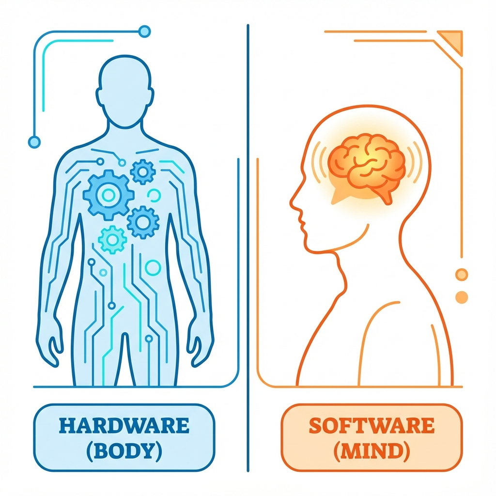
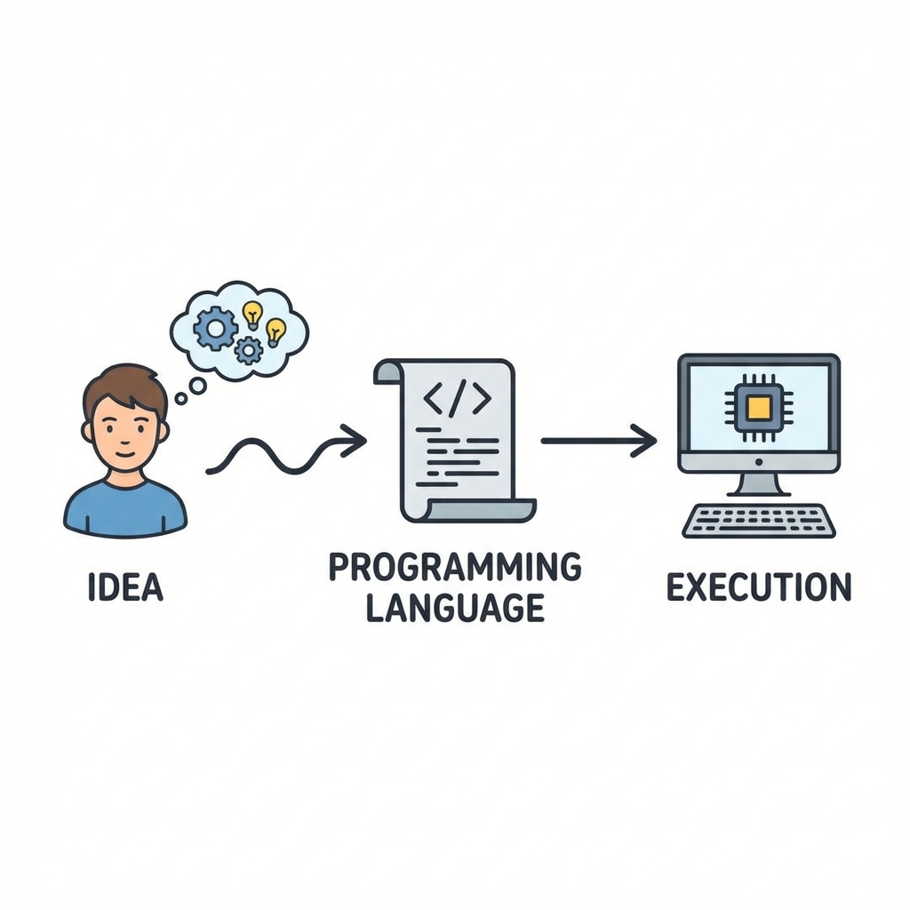

[← Back to Menu](pre-programming.md)

# Chapter 0: Introduction (နိဒါန်း)

ဂါရဝပါ။ "Pre-Programming Course" ကနိန် ကြိုဆိုပါရေ။ ကွန်ပျူတာပရိုဂရမ်းမင်းကို လေ့လာချင်ပနာ ဇာကစရဖို့လဲ မသိဖြစ်နီလူတိ၊ အခြေခံ သဘောတရားတိကို သေချာ နားလည်ချင်လူတိအတွက် ရည်ရွယ်ပါရေ။

ကျောင်းမှာ၊ လုပ်ငန်းခွင်မှာ ကွန်ပျူတာကို နိတိုင်း သုံးနီကေလေ့၊ ယင်းက ကွန်ပျူတာက ဇာပိုင် အလုပ်လုပ်လဲဆိုစွာကို သတိမထားမိတတ်ကတ်ပါ။ ဒေအခန်းမှာ ကွန်ပျူတာနန့် ပတ်သက်တေ အခြီခံအကျဆုံး အချက်တိကို မိတ်ဆက်ပီးလားပါဖို့။

## ၂။ ကွန်ပျူတာဆိုစွာ ဇာလဲ? (What is a Computer?)

ရှင်းရှင်းပြောရဖို့ဆိုကေ ကွန်ပျူတာဆိုစွာ အချက်အလက်တိ (Data) ကို လက်ခံယူရေ၊ တွက်ချက်ခွဲခြမ်းစိတ်ဖြာရေ (Process)၊ ပြီးကေ ရလဒ် (Output) ကို ပြန်ထုတ်ပီးရေ စက်ပစ္စည်း ဖြစ်ပါရေ။

ကွန်ပျူတာစနစ်တစ်ခုမှာ အဓိက အပိုင်း (၂) ပိုင်း ပါဝင်ပါရေ -

1.  **Hardware (ဟာ့ဒ်ဝဲလ်)**: ကိုင်တွယ်ထိတွိလို့ရတဲ့ အပိုင်းတိ ဖြစ်ပါရေ။ (ဥပမာ - Keyboard၊ Mouse၊ Screen၊ CPU၊ Hard Disk)။ ဒေဒါကို လူတစ်ယောက်ရဲ့ "ခန္ဓာကိုယ်" နန့် တူရေလို့ မြင်ယောင်ကြည့်နိုင်ပါရေ။
2.  **Software (ဆော့ဖ်ဝဲလ်)**: ကိုင်တွယ်လို့မရရေ ညွှန်ကြားချက်တိ ဖြစ်ပါရေ။ (ဥပမာ - Windows၊ Phone Apps၊ Games)။ လူတစ်ယောက်ရဲ့ "စိတ် သို့မဟုတ် အတွေးအခေါ်" နန့် တူပါရေ။

ခန္ဓာကိုယ် (Hardware) ဇာလောက်သန်မာသန်မာ၊ စိတ် (Software) မရှိကေ ဇာမှလုပ်လို့မရပါ။ Software တိကို ဖန်တီးပီးစွာကတော့ Programming ပဲ ဖြစ်ပါရေ။

## ၂။ ပရိုဂရမ်းမင်းဆိုစွာ ဇာလဲ? (What is Programming?)

Programming ဆိုစွာ ကွန်ပျူတာကို အလုပ်ခိုင်းခြင်း (Giving Instructions) ပါ။

ကွန်ပျူတာတိက အလိုလျောက် သိတတ်နားလည်ရေ အသိဉာဏ် မရှိပါ။ သူရို့ကို ဇာလုပ်ရဖို့လဲ ဆိုစွာ **တိတိကျကျ** ခိုင်းစေရပါရေ။ လူအချင်းချင်း စကားပြောရေပိုင် ပြောလို့မရပါ။ ကွန်ပျူတာ နားလည်တဲ့ ဘာသာစကား (Language) နန့် ပြောရပါရေ။

*ဥပမာ* - နိုင်ငံခြားသား တစ်ယောက်ကို လမ်းညွှန်ချင်ရေ ဆိုပါဖိ။ သူနားလည်တဲ့ ဘာသာစကား (ဥပမာ - အင်္ဂလိပ်စကား) နန့် ပြောမှရဖို့။ အေပိုင်ပါယာ၊ ကွန်ပျူတာနန့် ဆက်သွယ်ဖို့ Python, JavaScript, C++ စရေ **Programming Languages** တိကို သုံးရပါရေ။

## ၃။ ဇာဖြစ်လို့ သင်ယူသင့်လဲ? (Why Learn Programming?)

Software Developer တစ်ယောက် ဖြစ်ဖို့အတွက်ပဲ သင်ယူရစွာ မဟုတ်ပါ။

*   **Logic & Problem Solving**: ပြဿနာတိကို စနစ်တကျ တွေးခေါ် ဖြေရှင်းတတ်လာဖို့။
*   **Automation**: ပျင်းဖို့ကောင်းပနာ ထပ်ခါထပ်ခါ လုပ်နီရရေ အလုပ်တိကို ကွန်ပျူတာနန့် အစားထိုး ခိုင်းစီနိုင်ဖို့။
*   **Creation**: ကိုယ်ပိုင် Website၊ App သို့မဟုတ် Game တိကို ဖန်တီးနိုင်ပါဖို့။
*   **Career Opportunities**: နည်းပညာခေတ်မှာ အလုပ်အကိုင် အခွင့်အလမ်းတိ အများကြီး ရှိပါရေ။

---

**လေ့ကျင့်ခန်း (Exercise):**
1.  **Goal Setting**: မိတ်ဆွေ ဇာကြောင့် Programming သင်ချင်တာလဲ? သင်ပြီးရင် ဇာလုပ်ချင်လဲ? (ဥပမာ - Website ရွီးချင်လို့) စာအုပ်ထဲမှာ ချရေးပါ။
2.  **Hardware Hunt**: ပတ်ဝန်းကျင်မှာ Software နန့် မောင်းနှင်နီရေ ပစ္စည်း ၃ ခုကို ရှာဖွေပြီး စာရင်းပြုစုပါ။ (ဥပမာ - စမတ်ဖုန်း၊ TV remote၊ မီးပွိုင့်)။

## သင်ခန်းစာ အကျဉ်းချုပ်
- **Computer**: အချက်အလက် (Input) ကို ယူပြီး၊ တွက်ချက် (Process) ပနာ၊ ရလဒ် (Output) ထုတ်ပီးရေ စက်။
- **Hardware & Software**: ခန္ဓာကိုယ်နန့် စိတ် ပမာ တူညီပါရေ။
- **Programming**: ကွန်ပျူတာကို တိကျရေ ညွှန်ကြားချက်တိ ပီးခြင်း။

[Next: Chapter 1 >](chapter_1_cs_basics.md)

[Back to Main Menu >](../menu.md)
