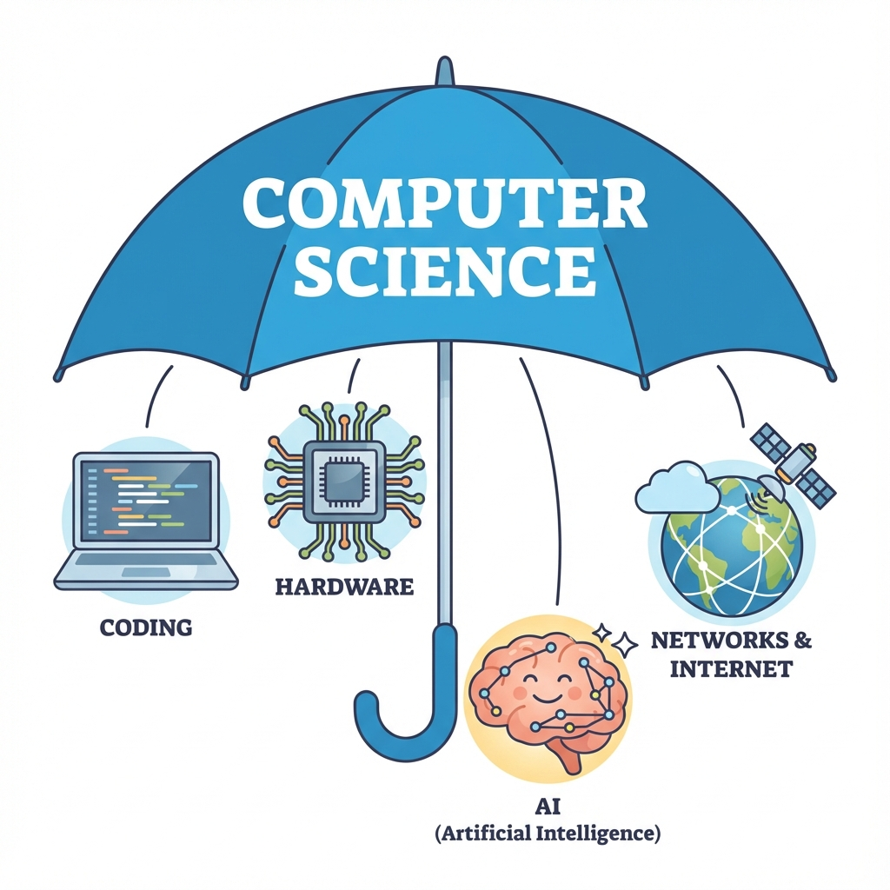
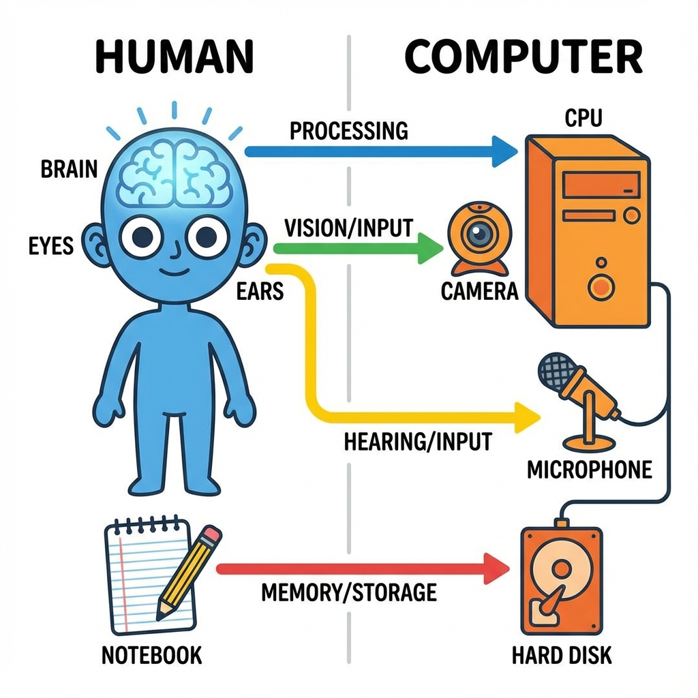
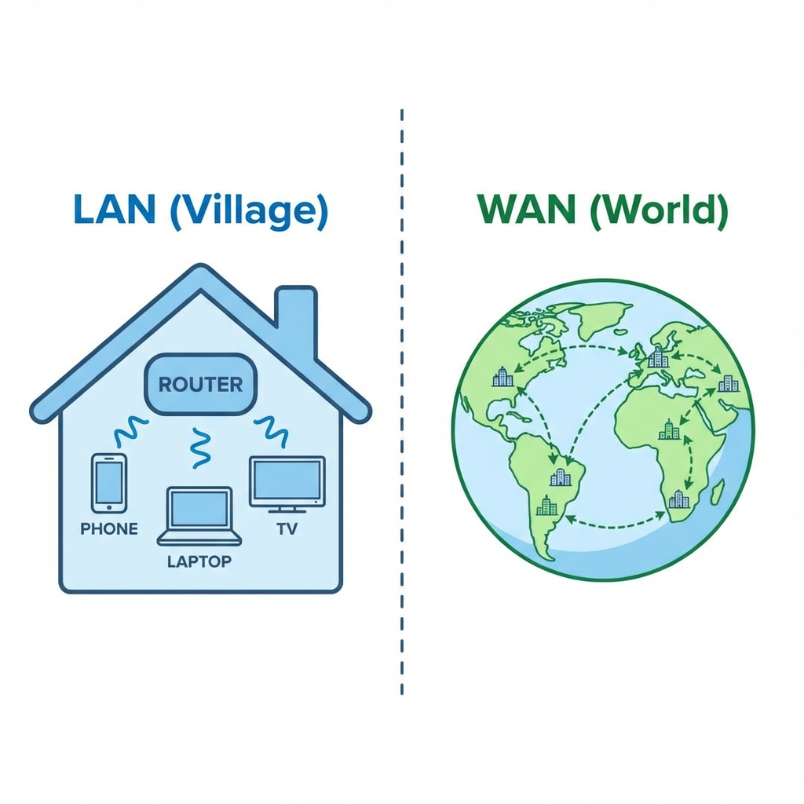
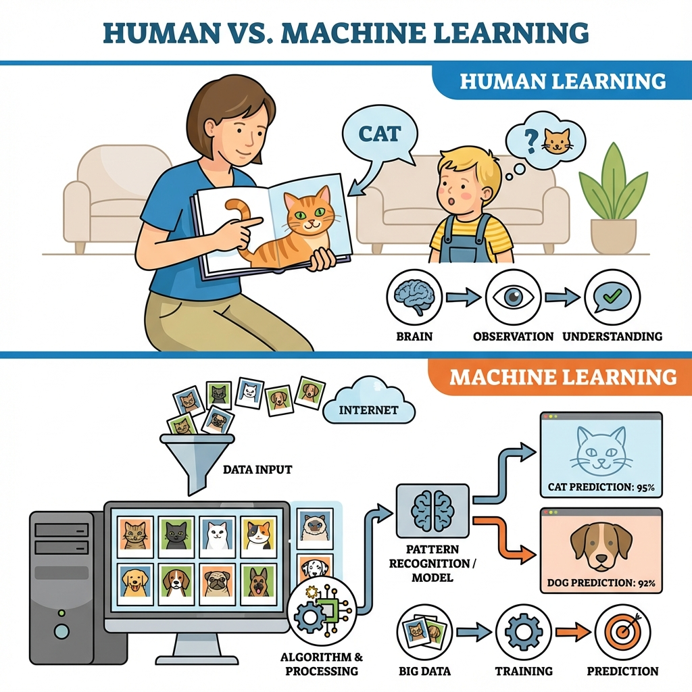

# Chapter 1: Computer Science Basics (ကွန်ပျူတာသိပ္ပံ အခြီခံ)

Computer Science ဆိုစွာ ကွန်ပျူတာတိအကြောင်းရာ မဟုတ်ပါ။ **ပြဿနာဖြေရှင်းခြင်း (Problem Solving)** အကြောင်း ဖြစ်ပါရေ။ အဓိက အပိုင်းကြီး (၄) ခု ပါဝင်ပါရေ။

## ၁။ Hardware: ကွန်ပျူတာ အစိတ်အပိုင်းတိအကြောင်း

Hardware ဆိုစွာ ကွန်ပျူတာဧ့ ကိုင်တွယ်လို့ရရေ အစိတ်အပိုင်းတိ ဖြစ်ပါရေ။ ကွန်ပျူတာ Hardware လုပ်ဆောင်ပုံကို လူခန္ဓာကိုယ်နန့် နှိုင်းယှဉ်ကြည့်နိုင်ပါရေ။

| လူခန္ဓာကိုယ် (Human) | ကွန်ပျူတာ (Computer) | လုပ်ဆောင်ချက် (Function) |
| :--- | :--- | :--- |
| **မျက်လုံး၊ နား** | **Input Devices** (Keyboard, Mouse, Camera) | အချက်အလက်တိကို လက်ခံယူဖို့ (See/Hear) |
| **ဦးနှောက်** | **CPU** (Central Processing Unit) | တွက်ချက်ဖို့၊ စဉ်းစားဖို့ (Think/Process) |
| **စာအုပ်/မှတ်ဉာဏ်** | **Storage** (Hard Disk / SSD) | အရာရာကို မှတ်သားထားဖို့ (Remember) |
| **ပါးစပ်၊ လက်** | **Output Devices** (Monitor, Printer, Speaker) | ရလဒ်ကို ပြောပြဖို့၊ ပြသဖို့ (Speak/Act) |

## ၂။ Networking: အင်တာနက်နန့် ချိတ်ဆက်မှုတိအကြောင်း

ကွန်ပျူတာတစ်လုံးတည်း အလုပ်လုပ်စွာထက်၊ ကွန်ပျူတာအချင်းချင်း ချိတ်ဆက်ပနာ အလုပ်လုပ်ကေ ပိုထိရောက်ပါရေ။

*   **LAN (Local Area Network)**: **"ရွာကလေး"** တစ်ရွာနန့် တူပါရေ။ အိမ်တစ်အိမ် (သို့) ရုံးခန်းတစ်ခု အနားမှာရှိရေ ကွန်ပျူတာတိ အချင်းချင်း ချိတ်ဆက်ထားစွာပါ။ (ဥပမာ - ရုံးမှာ Printer မျှဝေသုံးစွဲခြင်း)
*   **WAN (Wide Area Network)**: **"ကမ္ဘာကြီး"** နန့် တူပါရေ။ တစ်ကမ္ဘာလုံးက မြို့တိ၊ နိုင်ငံတိကို ချိတ်ဆက်ထားစွာပါ။ (ဥပမာ - Internet)

*   **Client-Server Concept**: စားသောက်ဆိုင် ဥပမာပိုင်ပါ။
    *   **Client (Customer)**: မှာယူလူ (ဖုန်း/ကွန်ပျူတာ)
    *   **Server (Chef)**: ချက်ပြုတ်ပီးလူ (Websites, Apps သိမ်းထားရာ နေရာ)

## ၃။ AI (Artificial Intelligence): စက်ရုပ်နန့် ဉာဏ်ရည်တုအကြောင်း

AI ဆိုစွာ ကွန်ပျူတာတိကို လူသားတိပိုင် တွေးခေါ်တတ်အောင် သင်ကြားပီးတဲ့ နည်းပညာ ဖြစ်ပါရေ။ ဇာပိုင် သင်ကြားပီးလဲ ဆိုစွာကို အောက်ပါပုံမှာ လေ့လာကြည့်ပါနန့်။

### လူနန့် AI သင်ယူပုံ နှိုင်းယှဉ်ချက်

1.  **Human Learning (လူသားများ သင်ယူခြင်း)**:
    *   အချေတစ်ယောက်ကို မိဘက "ဒါက ခွေးလေး"၊ "ဒါက ကြောင်လေး" လို့ ရုပ်ပုံကဒ်တိ ပြပြီး သင်ပီးရပါရေ။ အချေက အကြိမ်ကြိမ် ကြည့်ပြီး မှတ်သားပါရေ။

2.  **Machine Learning (စက်တိကို သင်ယူခြင်း)**:
    *   **Step 1 (Data Input)**: ကွန်ပျူတာကို ခွီးပုံပေါင်း (၁၀၀၀)၊ ကြောင်ပုံပေါင်း (၁၀၀၀) ထည့်သွင်းပီးရပါရေ။
    *   **Step 2 (Training)**: ကွန်ပျူတာက ယင်းပုံတိရဲ့ ကွာခြားချက် (ဥပမာ - နားရွက်ပုံစံ၊ နှာဖူးပုံစံ) ကို သူ့အလိုလို ရှာဖွေ လေ့လာပါရေ။
    *   **Step 3 (Prediction)**: လေ့လာပြီးလားရေအခါ၊ ပုံသစ်တစ်ပုံ ပြလိုက်ကေ "အေစာ ခွီးပါ" လို့ တိတိကျကျ ဖြေနိုင်လာပါရေ။

*   **Applications**: ဖုန်းထဲက Face ID (မျက်နှာကို မှတ်မိစွာ)၊ Google Translate (ဘာသာပြန်စွာ)၊ Driverless Cars (မောင်းသူမဲ့ ကားတိ)။

## ၄။ Programming: ကွန်ပျူတာကို ခိုင်းစီဖို့ ကုဒ်ရွီးခြင်း

အထက်ပါ Hardware, Network, AI တိ အားလုံး အလုပ်လုပ်ဖို့အတွက် ညွှန်ကြားချက်တိ လိုပါရေ။ ယင်းညွှန်ကြားချက်တိကို ရွီးသားခြင်းကို Programming လို့ ခေါ်ပါရေ။

### Hardware vs Software (နှိုင်းယှဉ်ချက်)

| Feature | Hardware (ဟာ့ဒ်ဝဲလ်) | Software (ဆော့ဖ်ဝဲလ်) |
| :--- | :--- | :--- |
| **Definition** | ထိတွေ့ကိုင်တွယ်၍ရသော အစိတ်အပိုင်းများ | ကွန်ပျူတာကို ခိုင်းစီရေညွှန်ကြားချက်တိ |
| **Example** | Monitor, Keyboard, CPU | Windows, Browser, Games |
| **Nature** | ပျက်စီးယိုယွင်းနိုင်သည် (Wear out) | ဟောင်းမလားပါ၊ Update လုပ်၍ရသည် |
| **Type** | Physical (ရုပ်ပိုင်းဆိုင်ရာ) | Logical (ယုတ္တိပိုင်းဆိုင်ရာ) |

*   **Low-level Language**: စက်နန့် နီးစပ်တဲ့ ဘာသာစကား (ဥပမာ - 0s and 1s, Assembly)။ ရွီးရခက်ပါရေ။
*   **High-level Language**: လူနားလည်လွယ်တဲ့ ဘာသာစကား (ဥပမာ - Python, JavaScript,Java)။ ကျွန်တော်တို့ လေ့လာဖို့က ဒေ High-level languages တိ ဖြစ်ပါရေ။

---
**လေ့ကျင့်ခန်း (Exercise):**
**Hardware Hunt** - သင့်ပတ်ဝန်းကျင် (အခန်းထဲ) ကို ကြည့်ပြီး အောက်ပါတို့ကို ရှာဖွေပါ။
1.  **Input Device** ၂ ခု (ဥပမာ - Phone Touchscreen, ...)
2.  **Output Device** ၂ ခု (ဥပမာ - Earbuds, ...)
---
*Computer Science ဟာ ပင်လယ်ပြင်ကြီးပိုင် ကျယ်ပါရေ။ အခုဖော်ပြခစွာကတော့ ငပလီကမ်းခြေက သဲပွင့်ချေတိလောက်ရာ ရှိပါသိရေ။*

## သင်ခန်းစာ အကျဉ်းချုပ်
- **Components**: Input, Output, CPU, Storage (မှတ်ဉာဏ်)။
- **Network**: LAN (ရွာ) နန့် WAN (ကမ္ဘာ)။
- **AI**: ကွန်ပျူတာကို လူပိုင် သင်ယူခိုင်းခြင်း (Machine Learning)။

 
