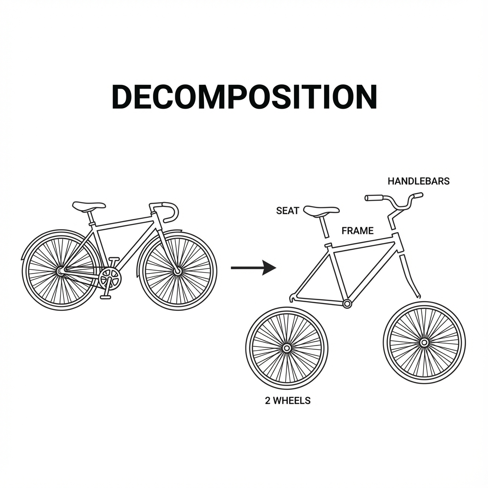
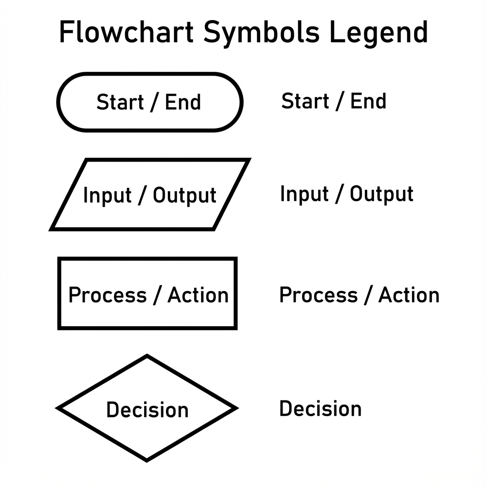
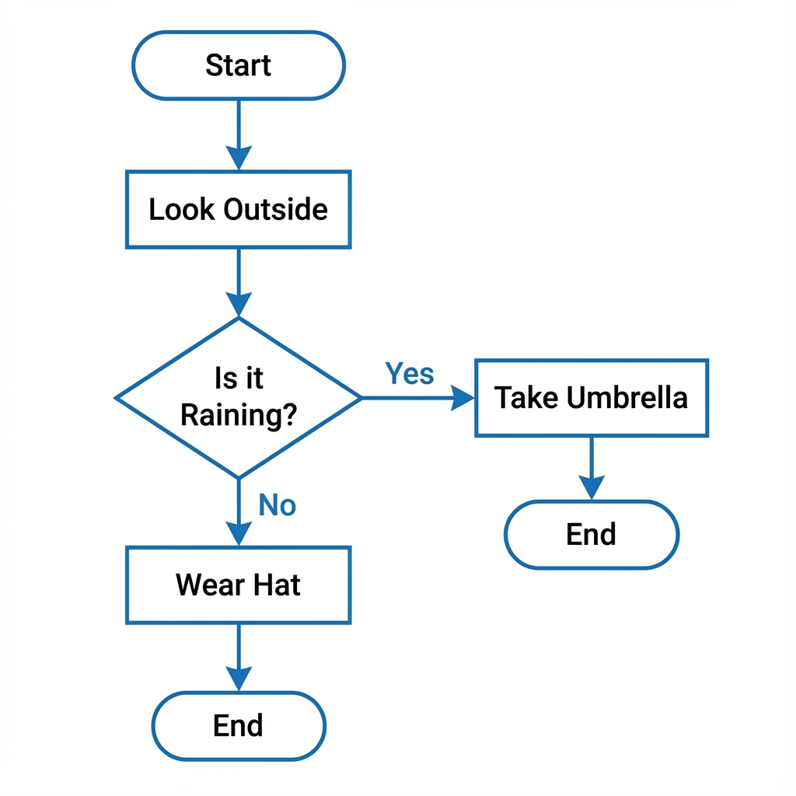

# Chapter 2: Logic & Algorithms (ယုတ္တိဗေဒနန့် လုပ်ထုံးလုပ်နည်းတိ)

ကွန်ပျူတာတစ်လုံးပိုင် ဇာပိုင် စဉ်းစားလဲဆိုစွာကို လေ့လာလားပါဖို့။ ကုဒ် (Code) တိ စမခင်မှာ အရေးအကြီးဆုံးက "အတွေးအခေါ်" (Thinking) ပါပဲ။

## ၁။ Thinking Like a Computer (ကွန်ပျူတာတစ်လုံးပိုင် တွေးခေါ်ခြင်း)

ကွန်ပျူတာတိက လူတိပိုင် ပါးနပ်မှု မရှိပါ။ သူရို့က ခိုင်းစွာကို တိတိကျကျ လုပ်တေ စက်တိပါ။ ယင်းကြောင့် ကျွန်တော်ရို့က ပြဿနာတစ်ခုကို ဖြေရှင်းချင်ကေ ကွန်ပျူတာ နားလည်အောင် အဆင့်ဆင့် ခွဲခြမ်းစိတ်ဖြာပနာ ပြောပြဖို့ လိုပါရေ။ **Computational Thinking** လို့ ခေါ်ပါရေ။

အေမှာ အဓိက သဘောတရား နှစ်ခု ရှိပါရေ -



This diagram shows how a complex object (a bicycle) is broken down into smaller, manageable parts.

1.  **Decomposition (ပြဿနာကို ခွဲခြမ်းစိတ်ဖြာခြင်း)**: ကြီးမားရှုပ်ထွီးရေ ပြဿနာကြီးကို ငယ်အောင်လုပ်ပနာ ဖြေရှင်းရလွယ်ကူရေ အပိုင်းချေတိအဖြစ် ခွဲထုတ်လိုက်စွာပါ။
    *   *ဥပမာ* - စက်သီးတစ်စီး တပ်ဆင်ဖို့ဗျာယ်ဆိုကေ ဂါရီတပ်ဖို့၊ ဟန်းကိုင်တပ်ဖို့၊ ထိုင်ခုံတပ်ဖို့ စသဖြင့် အပိုင်းလိုက် ခွဲလုပ်စွာမျိုးပေါ့။
2.  **Pattern Recognition (ပုံစံတူ ရှာဖွေခြင်း)**: ပြဿနာတိထဲမှာ တူညီရေ ပုံစံတိကို ရှာဖွေပနာ အဖြေထုတ်စွာပါ။

## ၂။ Algorithms ဆိုစွာ ဇာလဲ? (What is an Algorithm?)

Algorithm (အယ်လဂိုရစ်သမ်) ဆိုစွာ လုပ်ငန်းဆောင်တာတစ်ခု ပြီးဆုံးဖို့အတွက် လုပ်ဆောင်ရဖို့ အဆင့်ဆင့်သော ညွှန်ကြားချက်တိ (Step-by-step instructions) ဖြစ်ပါရေ။

**ဥပမာ - ခေါက်ဆွဲပြုတ်ခြင်း**
1.  အိုးထဲ ရီထည့်ပါ။
2.  ရီပူဆူအောင် တည်ပါ။
3.  ရီဆူလာကေ ခေါက်ဆွဲထည့်ပါ။
4.  ၃ မိနစ်ခန့် ပြုတ်ပါ။
5.  အမွှီးအကြိုင် ထည့်ပါ။
6.  ပန်းကန်ထဲ ထည့်ပနာ စားသုံးနိုင်ဗျာ။

ယင့်စာရေ Algorithm တစ်ခုပါယာ။ အဆင့်ကျော်လို့ မရပိုင်၊ အစီအစဉ် မှားလို့လေ့ မရပါ။ Programming ဆိုစွာကလည်း အေပိုင် ညွှန်ကြားချက်တိကို ကွန်ပျူတာနားလည်ရေ ဘာသာစကားနန့် ရွီးသားခြင်း ပါဗျာယ်။


## ၃။ Flowcharts & Pseudocode

ကျွန်တော်တို့ရဲ့ Algorithm တိကို ပုံဖော်ဖို့အတွက် Flowchart နန့် Pseudocode ကို သုံးပါရေ။

### Flowchart (စီးဆင်းမှုပုံပြကားချပ်)
Flowchart ဆိုစွာ လုပ်ဆောင်ပုံအဆင့်ဆင့်ကို ပုံတိ၊ မြှားတိနန့် ဆွဲပြစွာပါ။

**လေ့ကျင့်ခန်း (Exercise):**
1.  **"သွားတိုက်ခြင်း"** လုပ်ငန်းစဉ်ကို Algorithm ရွီးကြည့်ပါ။
2.  **Flowcharting a Sandwich**: ပေါင်မုန့်မီးကင် (Toast) လုပ်စားပုံကို Flowchart ဆွဲကြည့်ပါ။
    *   Decision ထည့်ပါ (ဥပမာ - ထောပတ်သုတ်မလား? Yes/No)။



*   **Oval (ဘဲဥပုံ)**: အစ (Start) နန့် အဆုံး (End) ကို ပြသပါရေ။
*   **Parallelogram (စတုဂံရွဲ့)**: အချက်အလက် သွင်းခြင်း/ထုတ်ခြင်း (Input/Output) ကို ပြသပါရေ။
*   **Rectangle (စတုဂံ)**: လုပ်ဆောင်ချက် (Process) ကို ပြသပါရေ။
*   **Diamond (စိန်ပုံ)**: ဆုံးဖြတ်ချက် (Decision) ကို ပြသပါရေ။ (Yes/No လမ်းခွဲတိ ထွက်လာပါရေ)



### Pseudocode (ကုဒ်တု)
Pseudocode ဆိုစွာ တကယ့် programming language မဟုတ်ဘဲ လူနားလည်လွယ်ဖို့ စကားလုံးတိနန့် ရွီးသားထားရေ ကုဒ်အကြမ်းဖျင်း ဖြစ်ပါရေ။ အောက်ပါ Keywords တိကို အသုံးများပါရေ -

| Keyword | Meaning (အဓိပ္ပာယ်) | Example |
| :--- | :--- | :--- |
| **INPUT / READ** | အချက်အလက် လက်ခံခြင်း | `INPUT temperature` |
| **OUTPUT / PRINT** | ရလဒ် ပြသခြင်း | `PRINT "Hello"` |
| **IF / ELSE** | ဆုံးဖြတ်ချက်ချခြင်း | `IF rain THEN take_umbrella ELSE wear_hat` |
| **WHILE / FOR** | ထပ်ခါထပ်ခါ လုပ်ဆောင်ခြင်း | `WHILE hungry DO eat` |
| **SET / COMPUTE** | တန်ဖိုးသတ်မှတ်ခြင်း/တွက်ချက်ခြင်း | `SET x = 5` |

**Pseudocode Example (မိုးရွာမရွာ စစ်ဆေးခြင်း):**
```
START
  Look_Outside
  IF Raining THEN
    PRINT "Take Umbrella"
  ELSE
    PRINT "Wear Hat"
  END IF
END
```

---

**လေ့ကျင့်ခန်း (Exercise):**
 မိုးသားဖက် လုပ်ရိုးလုပ်စဉ် (Morning Routine) ကို Algorithm တစ်ခုအနေနန့် အဆင့်ဆင့် ချရေးကြည့်ပါ။ (သွားတိုက်စွာ၊ မျက်နှာသစ်စွာ စသဖြင့် အသေးစိတ် ရွီးကြည့်ပါ)။

## သင်ခန်းစာ အကျဉ်းချုပ်
- **Computational Thinking**: ပြဿနာကို ခွဲခြမ်းစိတ်ဖြာခြင်း (Decomposition) နန့် ပုံစံတူရှာခြင်း (Pattern Recognition)။
- **Algorithm**: လုပ်ဆောင်ပုံ အဆင့်ဆင့် (Step-by-step instructions)။
- **Tools**: Flowchart (ပုံ) နန့် Pseudocode (စာ)။


 
