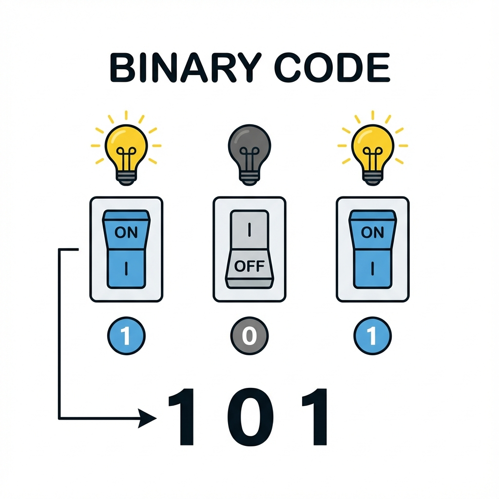
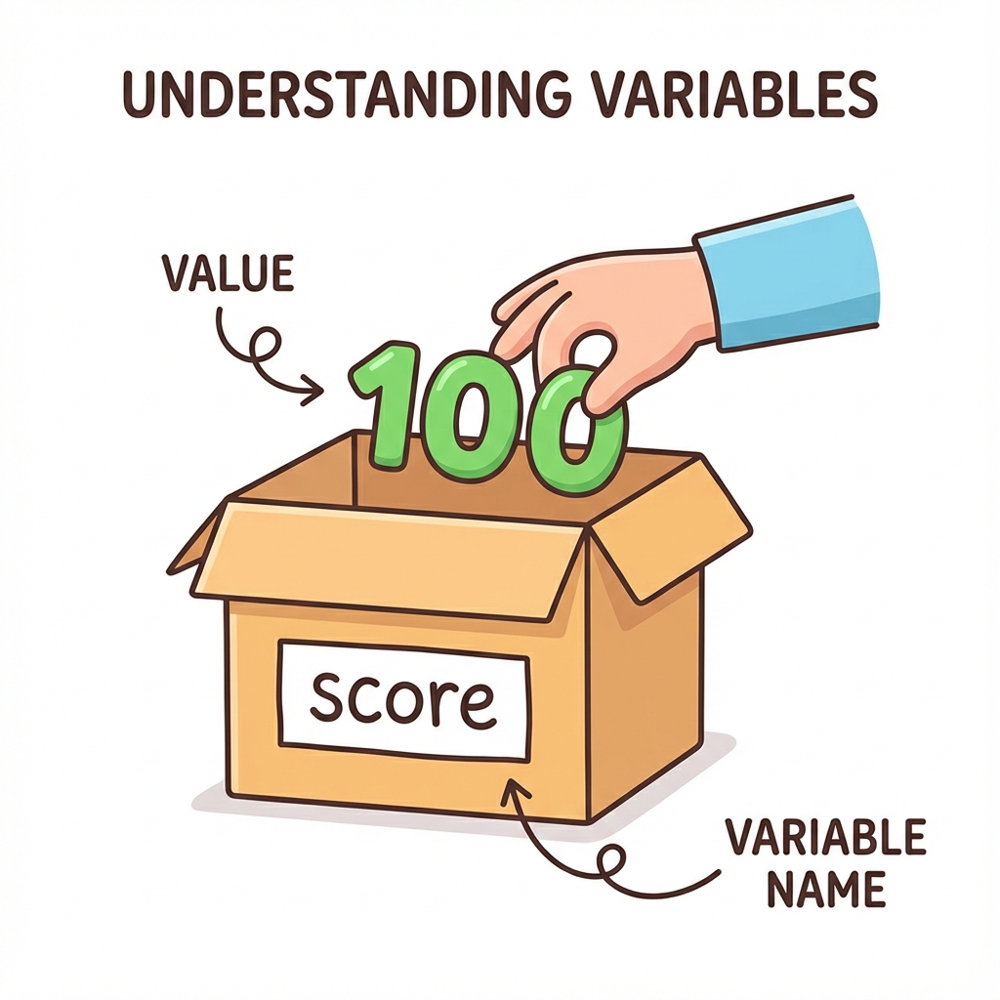

[← Back to Menu](pre-programming.md)

# Chapter 3: Data Representation (အချက်အလက်တိ သိမ်းဆည်းပုံ)

ကွန်ပျူတာတိက ကျွန်တော်တို့ မြင်နီရတဲ့ စာတိ၊ ပုံတိ၊ ဗီဒီယိုတိကို အေအတိုင်း မသိမ်းဆည်းပါ။ သူရို့က လျှပ်စစ်ပတ်လမ်းတိနန့် တည်ဆောက်ထားစွာဖြစ်လို့ **အဖွင့် (On)** နန့် **အပိတ် (Off)** အခြေအနေ နှစ်ခုကိုပဲ နားလည်ပါရေ။

## ၁။ Binary System (သုည နန့် တစ်)

"အဖွင့်" နန့် "အပိတ်" ကို ဂဏန်းနန့် ကိုယ်စားပြုကေ **1 (On)** နန့် **0 (Off)** ဖြစ်ပါရေ။ **Binary System** (ဒွိစုံသင်္ချာ) လို့ ခေါ်ပါရေ။

ကွန်ပျူတာထဲမှာ ရှိသမျှ အရာအားလုံး - ရိုက်လိုက်တေ စာလုံး 'A'၊ နားထောင်နီရေ တေးခင်း၊ ကြည့်နီရေ ဓာတ်ပုံ - အားလုံးကို နောက်ကွယ်မှာ `0` နန့် `1` တိ အများကြီးနန့် ဖွဲ့စည်းထားစွာပါ။

*   **Bit**: `0` သို့မဟုတ် `1` တစ်လုံးကို "Bit" လို့ ခေါ်ပါရေ။
*   **Byte**: Bit (၈) လုံး စုပေါင်းထားစွာကို "Byte" လို့ ခေါ်ပါရေ။ (ဥပမာ - `01000001`)

> [!TIP]
> **Brain Teaser**:
> `01000001` သည် `A` ဖြစ်လျှင် `01000010` သည် ဘာဖြစ်နိုင်မလဲ?
> (အဖြေ: `B` - Binary ဂဏန်းတိရေ တစ်ခုတိုးလားတိုင်း အက္ခရာစဉ်သည်လည်း တစ်ခုတိုးလားလေ့ဟိရေ)

### Data Sizes & Units (အချက်အလက် ပမာဏ အတိုင်းအတာများ)
ကျွန်တော်ရို့ ဖုန်းတိ၊ ကွန်ပျူတာတိမှာ Storage ဇလောက်ရှိရေလဲ ဆိုစွာကို အောက်ပါ အတိုင်းအတာတိနန့် ပြောလေ့ရှိပါရေ။

| Unit | Size | Analogy (ဥပမာ တင်စားချက်) |
| :--- | :--- | :--- |
| **Bit (b)** | 0 or 1 | အက်တမ် (Atom) တစ်ခု |
| **Byte (B)** | 8 bits | စာလုံး (Letter) တစ်လုံး (ဥပမာ 'A') |
| **Kilobyte (KB)** | 1,024 Bytes | စာတစ်မျက်နှာ (A page of text) |
| **Megabyte (MB)** | 1,024 KB | စာအုပ်တစ်အုပ် (A book) |
| **Gigabyte (GB)** | 1,024 MB | စာအုပ်စင်တစ်ခု (A bookshelf) |
| **Terabyte (TB)** | 1,024 GB | စာကြည့်တိုက်တစ်ခု (A library) |

> [!NOTE]
> ကွန်ပျူတာသည် 2 ၏ ထပ်ကိန်းများ (Powers of 2) ဖြင့် အလုပ်လုပ်သောကြောင့် 1,000 အစား **1,024** ဖြင့် မြှောက်လေ့ရှိပါသည်။

## ၂။ Variables & Data Types (ကိန်းရှင်တိနန့် အချက်အလက်အမျိုးအစားတိ)

Programming မှာ အချက်အလက်တိကို ခေတ္တသိမ်းဆည်းထားဖို့ **Variables (ကိန်းရှင်တိ)** ကို သုံးပါရေ။ Variable တစ်ခုကို "ပုံး" (Box) တစ်ခုလို့ မြင်ယောင်ကြည့်ပါ။

ပုံးတိုင်းမှာ နာမည်ရှိရပါဖို့ (ဥပမာ - `score`, `username`)။ အထဲမှာ တန်ဖိုး (Data) ထည့်လို့ရရေ။

### Data Types (အချက်အလက် အမျိုးအစားတိ)
ပုံးထဲကို ဇာထည့်မလဲပေါ်မူတည်ပနာ အမျိုးအစား ကွဲပြားပါရေ။

#### 1. Integer (ကိန်းပြည့်)
ဒသမ (အစက်အပျောက်) မပါရေ ကိန်းဂဏန်းတိ ဖြစ်ပါရေ။ ရေတွက်လို့ရရေ အရာတိအတွက် သုံးပါရေ။
*   *Example*: `age = 25`, `count = 100`, `year = 2024`

#### 2. Float (ဒသမကိန်း)
ဒသမ အစက်အပျောက် ပါရေ ကိန်းဂဏန်းတိ ဖြစ်ပါရေ။ အတိအကျ တိုင်းတာမှုတိအတွက် သုံးပါရေ။
*   *Example*: `price = 9.99`, `temperature = 36.5`, `pi = 3.14`

#### 3. String (စာသား)
စာလုံးတိကို စုစည်းထားစွာ ဖြစ်ပါရေ။ စာသားဖြစ်ကြောင်းပြဖို့ `"` (Quotes) သုံးရပါရေ။
*   *Example*: `name = "Mg Mg"`, `message = "Hello World"`, `phone = "09123456"` ("09..." သည် တွက်ချက်စရာမလိုသောကြောင့် String အဖြစ်ထားလေ့ရှိသည်)

#### 4. Char (စာလုံး)
စာလုံး တစ်လုံးတည်းကိုရာ ကိုယ်စားပြုပါရေ။
*   *Example*: `grade = 'A'`, `gender = 'M'`

#### 5. Boolean (အမှား/အမှန်)
`True` (မှန်) သို့မဟုတ် `False` (မှား) နှစ်မျိုးသာ ရှိပါရေ။ ဆုံးဖြတ်ချက်ချဖို့အတွက် သုံးပါရေ။
*   *Example*: `is_raining = True`, `has_passed = False`

### Why do Data Types Matter? (အချက်အလက် အမျိုးအစားတိ ဇာဖြစ်လို့ အရေးကြီးလဲ?)
ကွန်ပျူတာက Data Type ပေါ်မူတည်ပနာ အလုပ်လုပ်ပုံ ကွဲပြားလို့ပါ။

*   **Numbers**: `1 + 1` လို့ ရေးရင် ကွန်ပျူတာက **2** လို့ ပေါင်းပြပါဖို့။
*   **Strings**: `"1" + "1"` လို့ ရေးရင် ကွန်ပျူတာက စာသားနှစ်ခု ဆက်ပနာ **"11"** လို့ ပြပါဖို့။

ကိုယ်လိုချင်တဲ့ ရလဒ်ရဖို့ Data Type မှန်ကန်စွာ သုံးဖို့ လိုပါရေ။

---

**လေ့ကျင့်ခန်း (Exercise):**
1.  **My Age in Binary** - သင့်အသက်ကို Binary ပြောင်းကြည့်ပါ။
    *   အဆင့် (၁): အသက်ကို ချရေးပါ (ဥပမာ - 20)။
    *   အဆင့် (၂): 128, 64, 32, 16, 8, 4, 2, 1 တန်ဖိုးများကို သုံးပြီး ပေါင်းစပ်ကြည့်ပါ။
    (Hint: 20 = 16 + 4, So binary is `00010100`)
2.  မိတ်ဆွေရဲ့ နာမည်၊ အသက် နန့် အရပ်အမောင်းကို Variable တိအဖြစ် ဖန်တီးကြည့်ပါ။ ဇာ Data Type ကို သုံးမလဲ စိုင်းစားပါ။
    (ဥပမာ - `name = "Mg Mg"` (String))

## သင်ခန်းစာ အကျဉ်းချုပ်
- **Binary**: 0 နန့် 1 ကိုသာ ကွန်ပျူတာ နားလည်ပါရေ။
- **Variables**: Data သိမ်းရေ ပုံးတိ။
- **Data Types**: Integer (ကိန်းပြည့်)၊ String (စာသား)၊ Boolean (အမှား/အမှန်)။

[Next: Chapter 4 >](chapter_4_control_structures.md)

[Back to Main Menu >](../README.md)
