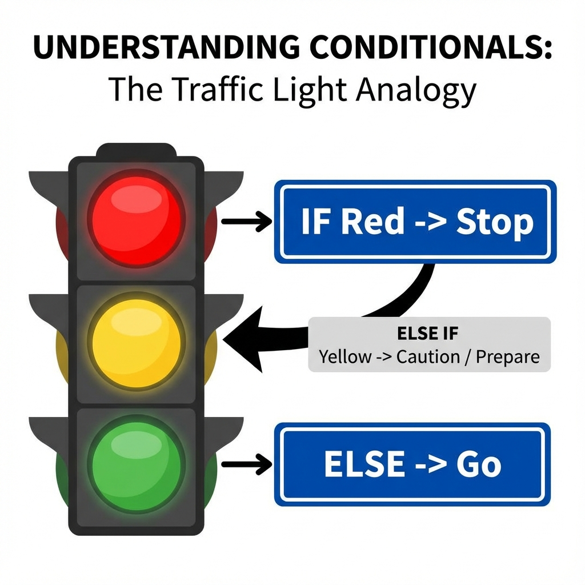
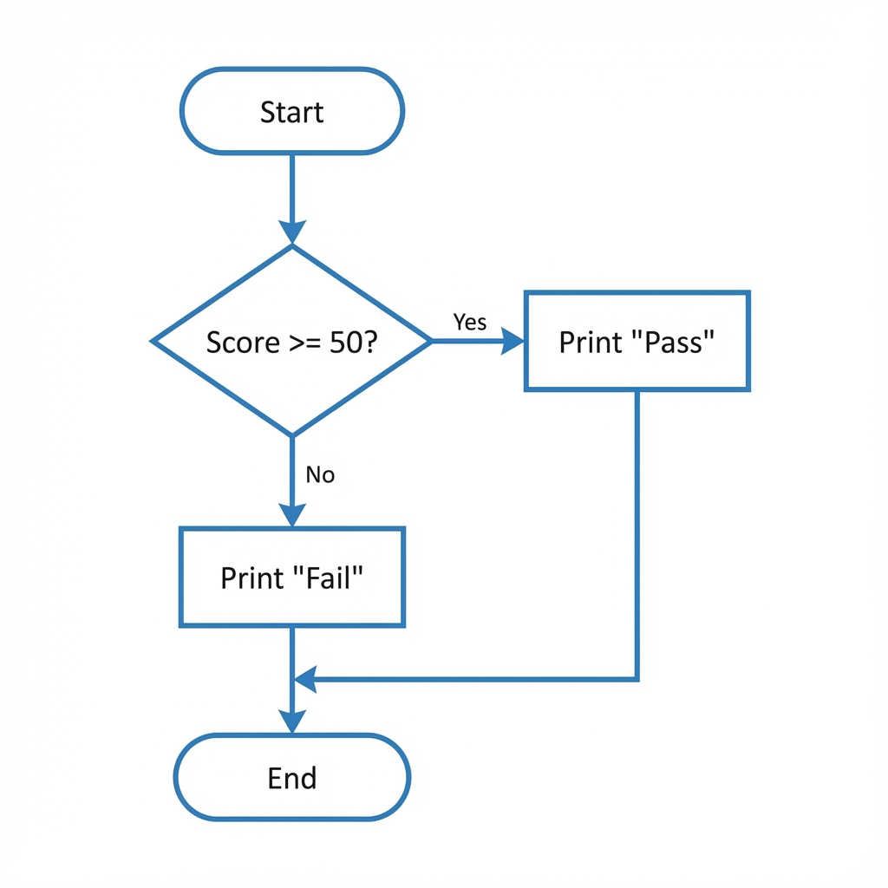
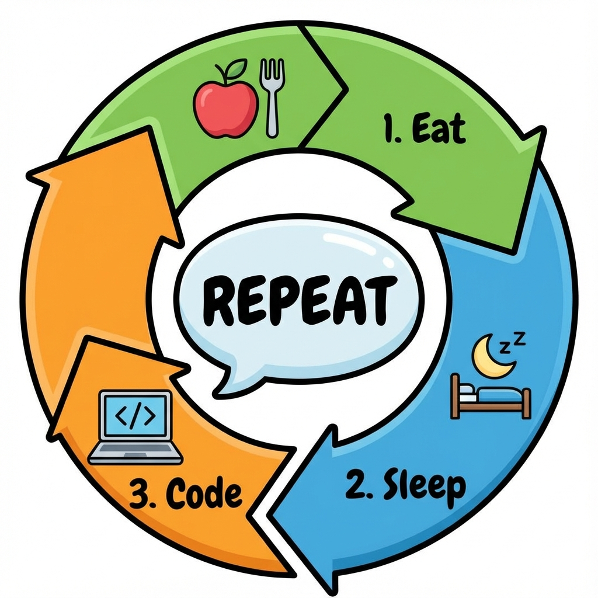

# Chapter 4: Control Structures (ထိန်းချုပ်မှု တည်ဆောက်ပုံတိ)

ပရိုဂရမ်တစ်ခုစာ အထက်ကနီ အောက်ကို တစ်ကြောင်းချင်းစီ ပုံမှန် အလုပ်လုပ်ပါရေ။ ယကေလေ့ တစ်ခါတလေမှာ ကျွန်တော်တို့က အချို့အလုပ်တိကို ကျော်ခိုင်းချင်စွာ (သို့မဟုတ်) ထပ်ခါထပ်ခါ လုပ်ခိုင်းချင်စွာမျိုး ရှိပါရေ။ ယင့်စာကို **Control Structures** နန့် လုပ်ဆောင်နိုင်ပါရေ။

## ၁။ Sequence (အစဉ်လိုက် လုပ်ဆောင်ခြင်း)

ပုံမှန် အလုပ်လုပ်ပုံပါ။ ညွှန်ကြားချက်တိကို အထက်ဆုံးစာကြောင်းကနီ အောက်ဆုံးထိ တစ်ဆင့်ချင်းစီ လုပ်လားစွာ ဖြစ်ပါရေ။ အဆင့်ကျော်လို့ မရပါ။

```text
START
  Wake Up
  Brush Teeth
  Eat Breakfast
END
```

---

## ၂။ Selection (ရွီးချယ်လုပ်ဆောင်ခြင်း)

အခြေအနိန်တစ်ခုပေါ် မူတည်ပနာ ဇာဆက်လုပ်ရဖို့လဲ ဆုံးဖြတ်စွာပါ။ **If, Else** statements တိကို သုံးပါရေ။



### Example: စာမေးပွဲ အောင်/ရှုံး (Pass or Fail)
အောက်ပါ Flowchart မှာ အမှတ် ၅၀ ကျော်ကေ "Pass"၊ မကျော်ကေ "Fail" လို့ ပြသပုံကို တွက်ချက်ပြထားပါရေ။



---


```
IF Score >= 50 THEN
    PRINT "Pass"
ELSE
    PRINT "Fail"
END IF
```

## ၃။ Iteration (ထပ်ခါထပ်ခါ လုပ်ဆောင်ခြင်း)

အေစာကို **Loop** ပတ်ရေလို့ ခေါ်ပါရေ။ အလုပ်တစ်ခုကို အကြိမ်အရေအတွက် တစ်ခုအထိ (သို့မဟုတ်) အခြေအနေတစ်ခု ပြည့်လားတဲ့အထိ ထပ်ခါထပ်ခါ လုပ်ခိုင်းစွာပါ။



### 3.1 Loop အမျိုးအစားတိ

#### A. For Loop (အကြိမ်ရေ အတိအကျ သိသောအခါ)
အလုပ်တစ်ခုကို ဇာနှစ်ခါ လုပ်ပါဆိုပြီး အတိအကျ ခိုင်းချင်တဲ့အခါ သုံးပါရေ။
*Example: ၁၀ ပတ်တိတိ ပြေးပါ (Run 10 laps).*

```text
START
  count = 0
  WHILE count < 10
    Run 1 Lap
    count = count + 1
  END WHILE
  Stop Running
END
```

#### B. While Loop (အခြေအနေတစ်ခုပေါ် မူတည်သောအခါ)
အကြိမ်ရေ မသိလည်း အခြီအနနိတစ်ခု မှန်နီသရွိ့ ဆက်လုပ်နီစီချင်ရေအခါ သုံးပါရေ။
*Example: ဝမ်းမဝမချင်း စားပါ (Eat while hungry).*

```text
START
  WHILE Hungry is True
    Eat Food
  END WHILE
  Stop Eating
END
```

---


## သင်ခန်းစာ အကျဉ်းချုပ်
- **Sequence**: အစဉ်လိုက် လုပ်ဆောင်ခြင်း။
- **Selection**: အခြေအနေပေါ်မူတည်ပနာ ရွီးချယ်ခြင်း (If/Else)။
- **Iteration**: ထပ်ခါထပ်ခါ လုပ်ဆောင်ခြင်း (Loops)။

**လေ့ကျင့်ခန်း (Exercise):**
1.  **Staircase Algorithm**: လှေကား ၁၀ ထစ် တက်ပုံကို Algorithm ရေးပါ။
    *   **For Loop**: လှေကားထစ် အရွီအတွက် သိတဲ့အခါ (၁၀ ထစ်)။
    *   **While Loop**: လှေကားထစ် မသိတဲ့အခါ (အထက်ဆုံး မရောက်မချင်း တက်မယ်)။
2.  နိတိုင်း ထပ်ခါထပ်ခါ လုပ်နီတဲ့ အလုပ်တစ်ခုကို Loop နဲ့ ရေးကြည့်ပါ။


 
