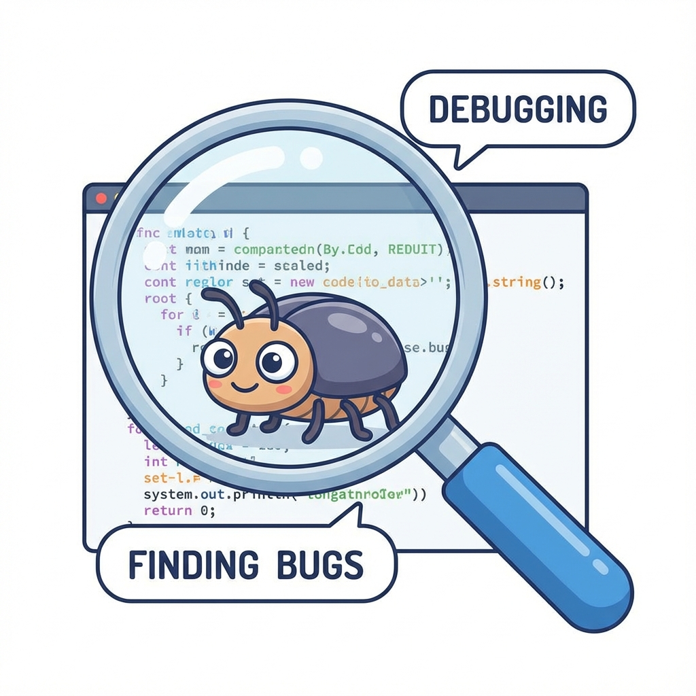

[← Back to Menu](pre-programming.md)

# Chapter 5: Problem Solving & Debugging (ပြဿနာဖြေရှင်းခြင်းနန့် အမှားရှာခြင်း)

Code ရွီးတတ်ရုံနန့် မပြီးပါ။ Programmer ကောင်းတစ်ယောက်ဖြစ်ဖို့ ပြဿနာတိကို စနစ်တကျ ဖြေရှင်းတတ်ဖို့နန့် ကိုယ်ရွီးထားရေ Code မှာ အမှားပါကေ ရှာဖွေပြင်ဆင်တတ်ဖို့ လိုပါရေ။

## ၁။ IPO Model (Input-Process-Output)

ကွန်ပျူတာပရိုဂရမ်တိုင်းဧ့ အခြီခံလုပ်ဆောင်ပုံကတော့ IPO Model ပါ။ ပြဿနာတစ်ခုကို ဖြေရှင်းဖို့ဆိုကေ ဒီ (၃) ပိုင်း ခွဲပြီး စိုင်းစားရပါဖို့။

1.  **Input**: ဇာတိ လိုအပ်သလဲ? (ကုန်ကြမ်း)
2.  **Process**: ဇာတိ လုပ်ဆောင်ရဖို့လဲ? (လုပ်ဆောင်ချက်)
3.  **Output**: ဇာရလဒ် လိုချင်စွာလဲ? (ကုန်ချော)

```text
[Input: Ingredients] -> [Process: Cooking] -> [Output: Meal]
```


*ဥပမာ - ထမင်းကြော်ခြင်း*
... (Retain text) ...


*ဥပမာ - ထမင်းကြော်ခြင်း*
*   **Input**: ထမင်း၊ ကြက်ဥ၊ ဆီ၊ ဆား
*   **Process**: ကြော်ဗျ၊ ဆီထည့်၊ ကြက်ဥမွှေ၊ ထမင်းထည့်ကြော်
*   **Output**: ထမင်းကြော်

## ၂။ Debugging (အမှားရှာခြင်း)

Code ရေးကေ အမှား (Bug) ဆိုစွာ မလွဲမသွေ ကြုံရမှာပါ။ ယင်းအမှားတိကို ရှာဖွေပြင်ဆင်ခြင်းကို **Debugging** လို့ ခေါ်ပါရေ။



### The Debugging Cycle (အမှားရှာဖွေခြင်း သံသရာ)
အမှားရှာခြင်းဆိုစာ တစ်ခါတည်းနဲ့ ပြီးရေအလုပ် မဟုတ်ပါ။ အမှားမကင်းမချင်း ထပ်ခါထပ်ခါ လုပ်ရတဲ့ လုပ်ငန်းစဉ်ပါ။

```text
1. START: Run Program
2. CHECK: Is there an Error?
   - NO:  Success! (END)
   - YES: Go to Step 3
3. READ: Read Error Message
4. LOCATE: Find Line Number
5. FIX: Edit Code
6. RETRY: Go back to Step 1
```

### Common Error Types (အမှားအမျိုးအစားတိ)
Programming မှာ အမှား (၂) မျိုး အတွေ့ရများပါရေ။

1.  **Syntax Errors (သဒ္ဒါအမှား)**:
    *   ဘာသာစကား စည်းမျဉ်းစည်းကမ်း မှားစွာပါ။ ဥပမာ - စာလုံးပေါင်းမှားစွာ၊ ကွင်းပိတ်ကျန်ခစွာ။
    *   *Analogy*: "စိုက် ချီး" လို့ ပြောလိုက်သလိုမျိုးပါ။ အဓိပ္ပာယ်တော့ ရှိပေမယ့် စကားလုံး အစီအစဉ် မှားနေလို့ နားမလည်တာမျိုးပါ။
    *   ကွန်ပျူတာက ယင့်ပိုင်အမှားမျိုးဆို ချက်ချင်းတန့်လားဖို့ ပြောပြပါရေ။

2.  **Logic Errors (ယုတ္တိအမှား)**:
    *   စည်းမျဉ်းတော့ မှန်ရေ၊ ယကေလေ့ ကိုယ်လိုချင်တဲ့ အဖြေမထွက်စွာပါ။ ဥပမာ - ပေါင်းရဖို့အစား နှုတ်မိစွာ။
    *   *Analogy*: "ဆားထည့်ပါ" လို့ ပြောရဖို့အစား "သကြားထည့်ပါ" လို့ မှားပြောမိတာမျိုးပါ။ ဟင်းချက်လို့တော့ ရကေလည်း အရသာ (Output) မှားသွားပါလိမ့်မယ်။
    *   ဒေအမှားက ရှာရ နည်းနည်းခက်ပါရေ။ Program က Run လို့ရနေလို့ပါ။

### 2.1 Common Logic Errors (အတွိ့ရများရေ ယုတ္တိအမှားတိ)
1.  **Infinite Loop**: Loop ပတ်တာ လုံးဝ မရပ်ဘဲ Program ဟန်း (Hang) လားခြင်း။ (Stop Condition မှားရွီမိလို့ ဖြစ်တတ်သည်)
2.  **Off-by-one Error**: ၁၀ ကြိမ် လုပ်ရမည့်အစား ၉ ကြိမ် (သို့) ၁၁ ကြိမ် လုပ်မိခြင်း။

### အမှားရှာနည်းတိ
*   **Rubber Duck Debugging**: ကိုယ့်ပြဿနာကို အရုပ်ချေတစ်ရုပ် (သို့မဟုတ် သူငယ်ချင်း) ကို တစ်ဆင့်ချင်းစီ ပြန်ရှင်းပြကြည့်ပါ။ ရှင်းပြရင်းနန့် အမှားကို ကိုယ်တိုင် သတိထားမိလာတတ်ပါရေ။
*   **Print Statements**: Code နေရာအနှံ့မှာ စာတိ ထုတ်ကြည့်ပနာ ဇာနားရောက်ကေ မှားလားလဲ လိုက်စစ်ဆေးစွာပါ။

---

**လေ့ကျင့်ခန်း (Exercise):**
1.  **Debug the Tea**: လက်ဖက်ရည်ဖျော်နည်း Algorithm မှာ အောက်ပါ အမှားနှစ်ခု ပါနီပါရေ၊ ပြင်ဆင်ရွီးသားပီးပါ။
    *   *Step 1*: ရေနွီးအိုး တည်ပါ။
    *   *Step 2*: ခွက်ထဲကို လက်ဖက်ခြောက် ထည့်ပါ။
    *   *Step 3*: သကြား ထည့်ပါ။
    *   *Step 4*: ရီနွီး ဆူဗျာယ်။ (ရီနွီးမထည့်ရသိပါ!)
    *   *Step 5*: သောက်ပါ။
2.  ဖုန်းပျောက်လားရေ ဆိုပါစို့။ ဖုန်းပြန်ရှာဖို့အတွက် IPO Model ကိုသုံးပနာ ဇာပိုင် ဖြေရှင်းမလဲ စဉ်းစားရွီးသားပါ။

## သင်ခန်းစာ အကျဉ်းချုပ်
- **IPO Model**: Input -> Process -> Output။
- **Debugging**: အမှားရှာဖွေ ပြင်ဆင်ခြင်း။
- **Errors**: Syntax Error (သဒ္ဒါမှား) vs Logic Error (တွေးခေါ်ပုံမှား)။


[Next: Conclusion >](chapter_6_conclusion.md)

[Back to Main Menu >](../README.md)
