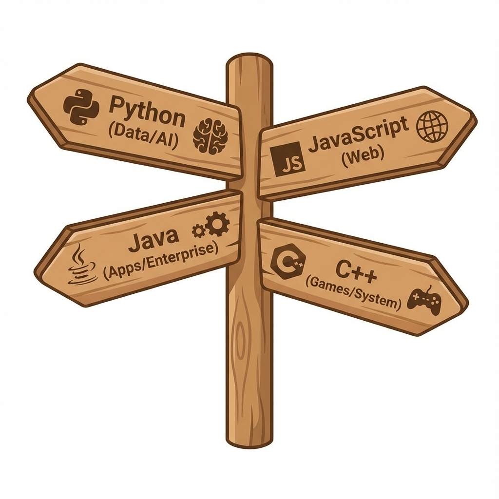

# Chapter 6: Conclusion & Next Steps (နိဂုံးနန့် ရှေ့ဆက်ရန်)

 အခုအချိန်မှာ "Code မရေးတတ်သိးကေလေ့ Programmer တစ်ယောက်ပိုင် တွေးခေါ်တတ်နီဗျာ" လို့ ပြောနိုင်ပါရေ။

## ၁။ ဇာဘာသာစကားကို စလေ့လာသင့်လဲ? (Choosing your first language)

လူတိုင်းမီးကတ်တေ မေးခွန်းပါ။ အဖြေကတော့ "ဇာလုပ်ချင်လဲ?" ပေါ်မှာ မူတည်ပါရေ။

1.  **Python**:
    *   **ဇာလုပ်လို့ရလဲ**: Data Science, Artificial Intelligence (AI), Web Backend, Automation.
    *   **အားသာချက်**: လွယ်ရေ၊ လူသုံးများရေ။ Beginner တိအတွက် အသင့်တော်ဆုံးပါ။

2.  **JavaScript**:
    *   **ဇာလုပ်လို့ရလဲ**: Web Development (Websites ဖန်တီးချင်ကေ မဖြစ်မနေ သင်ရပါဖို့)။
    *   **အားသာချက်**: Browser တိုင်းမှာ Run လို့ရရေ။ ရလဒ်ကို ချက်ချင်း မြင်ရရေ။

3.  **Java**:
    *   **ဇာလုပ်လို့ရလဲ**: Android Apps, Enterprise Software (ဘဏ်လို ကြီးမားတဲ့ လုပ်ငန်းကြီးတိရဲ့ System).
    *   **အားသာချက်**: နေရာစုံမှာ သုံးလို့ရရေ။ (Write Once, Run Anywhere).

4.  **C / C++**:
    *   **ဇာလုပ်လို့ရလဲ**: Game Development, Computer Software.
    *   **အားသာချက်**: ကွန်ပျူတာရဲ့ လုပ်ဆောင်မှုကို နက်နက်နဲနဲ နားလည်စေပါရေ။

## ၂။ ဆက်လက်လေ့လာရန် အရင်းအမြစ်တိ

*   **FreeCodeCamp**: Web Development အတွက် အကောင်းဆုံး အခမဲ့ နေရာပါ။
*   **CS50 (Harvard)**: Computer Science အခြေခံကို သေချာသင်ချင်ကေ Harvard တက္ကသိုလ်ရဲ့ CS50 Course ကို YouTube မှာ အခမဲ့ ကြည့်ရှုနိုင်ပါရေ။
*   **W3Schools**: ကုဒ်တိကို လက်တွေ့ စမ်းရေးကြည့်ဖို့ ကောင်းပါရေ။

## ၃။ Programming Ethics (ကျင့်ဝတ်တိ)

Programmer တစ်ယောက်မှာ စွမ်းရည် (Power) ရှိသလို တာဝန်ယူမှု (Responsibility) လည်း ရှိရပါဖို့။

*   **Do No Harm**: သူတစ်ပါးကို ထိခိုက်စေမယ့် Virus တိ၊ Hack စွာတိ မလုပ်ရပါ။
*   **Respect Privacy**: အသုံးပြုလူတိရဲ့ ကိုယ်ရေးအချက်အလက် (Data) ကို လေးစားလိုက်နာရပါဖို့။
*   **Be Honest**: မိမိရွီးရေ ကုဒ်ကြောင့် ဖြစ်လာမယ့် အကျိုးဆက်တိကို တာဝန်ယူရပါဖို့။

## ၄။ နိဂုံး (Final Words)

Programming သင်ယူရစွာ ခက်ခဲနိုင်ပါရေ။ အထူးသဖြင့် အစပိုင်းမှာပါ။ Error တက်တိုင်း စိတ်မပျက်ပါကေ့။ Programmer တိုင်း (Google မှာ လုပ်နီလူတိတောင်မှ) နိတိုင်း Error တက်ပနာ နိတိုင်း ရှာဖွေဖြေရှင်းနီကြရစွာပါ။

"Consistency is Key" - နိတိုင်း နည်းနည်းချင်းစီ ပုံမှန် လေ့လာလားပါ။

**လေ့ကျင့်ခန်း (Exercise):**
**Your First Project Idea**:
ဒီစာအုပ်ကို ဖတ်ပြီးတဲ့နောက် သင် ပထမဆုံး ကိုယ်တိုင် ရွီးချင်ရေ Project တစ်ခုကို စဉ်းစားပါ။
*   **Project Name**: (ဥပမာ - My Calculator)
*   **Purpose**: (ဇာလုပ်ပီးဖို့လဲ?)
*   **Inputs**: (ဇာတိ ထည့်သွင်းရဖို့လဲ?)

ဖိုက်တင်းပါ။

## သင်ခန်းစာ အကျဉ်းချုပ်
- **Language Choice**: Web (JS)၊ AI (Python)၊ System (C++)။
- **Ethics**: သူတစ်ပါးကို မထိခိုက်စီရ၊ Data ကို လေးစားရမည်။
- **Consistency**: နေ့စဉ် ပုံမှန် လေ့လာခြင်းက အဓိက။

 
