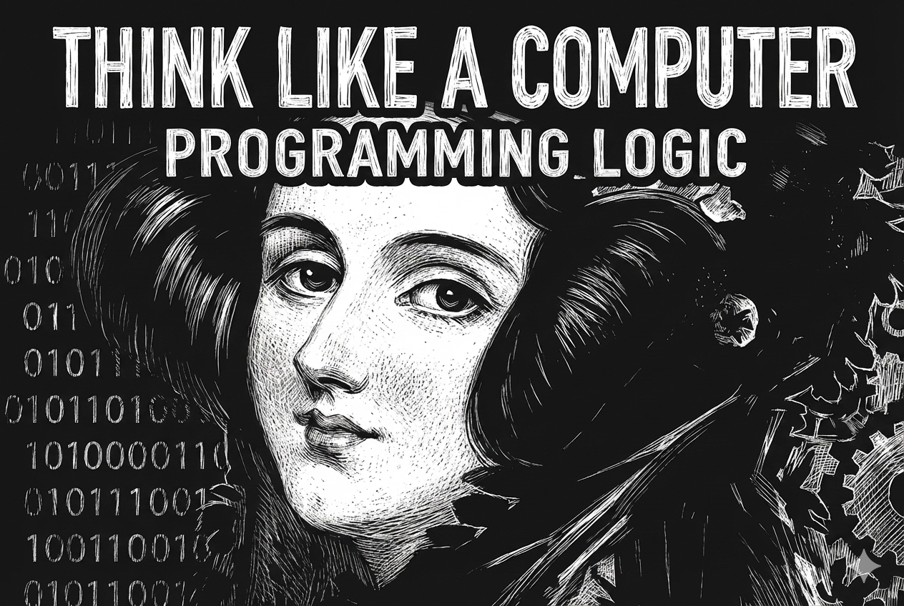

# ကွန်ပျူတာတစ်လုံးပိုင် တွီးခေါ်ခြင်း - ပရိုဂရမ်းမင်း လောဂျစ်နှင့် အခြီခံ (v0.2)
*(Think Like a Computer: The Complete Programming Logic)*
***ကျော်ထွန်းလင်း***

ဂါရဝပြုပါရေ 

## စာအုပ်အကြောင်း
အေစာအုပ်က ကွန်ပျူတာ ပရိုဂရမ်းမင်းကို အခြီခံကစလို့ လေ့လာချင်ရေ လူတိအဖို့ ရွီးသားထားစွာ ဖြစ်ပါရေ။ ကွန်ပျူတာတစ်လုံးပိုင် ဇာပိုင်တွီးခေါ်ဖို့လဲ၊ အချက်အလက်တိကို ဇာပိုင် စနစ်တကျ သိမ်းဆည်းဖို့လဲဆိုစွာတိကို သင်ကြားပီးလားပါဖို့။ ဘာသာစကားတစ်ခုကို အလွတ်ကျက်မှတ်နီဖို့အစား Logic နန့် Theory သဘောတရားတိကို ဦးစားပီး တင်ပြထားပါရေ။

## အသူရို့ ဖတ်သင့်လဲ?
- ကွန်ပျူတာ ပရိုဂရမ်းမင်းကို စိတ်ဝင်စားရေ လူငယ်တိ။
- Computer Science (CS) ဘာသာရပ်ကို စလေ့လာနီရေ ကျောင်းသား/သူ တိ။
- Logic နန့် Algorithm ကို သေချာ နားလည်ချင်သူတိ။

## ရရှိနိုင်ဖို့ အကျိုးကျေးဇူးတိ
- **အခြီခံခိုင်မာခြင်း**: Programming ဘာသာစကားတစ်ခုကို စလေ့လာရေအချိန်မှာ အခက်အခဲမဟိဘဲ သဘောတရားကိုအယင် နားလည်လာနိုင်ပါဖို့။
- **တွေးခေါ်ပုံပြောင်းလဲခြင်း**: ပြဿနာတစ်ခုကို ကွန်ပျူတာတစ်လုံးပိုင် စနစ်တကျ ခွဲခြမ်းစိတ်ဖြာပြီး ဖြေရှင်းတတ်လာပါဖို့ (Computational Thinking)။
- **လက်တွိ့အသုံးချနိုင်ခြင်း**: သီအိုရီသက်သက်မဟုတ်ဘဲ လက်တွိ့လုပ်ငန်းခွင်မှာသုံးရေ ATM, Social Media စနစ်တိကိုပါ ကိုယ်တိုင် အခြီနိန်ပေါ်မူတည်ပနာ စဉ်းစားတည်ဆောက်တတ်လာပါဖို့။

## လေ့လာဖို့ လမ်းညွှန်ချက်
- **အစိုင်လိုက်လေ့လာပါ**: Pre-Programming ကနိန်စလို့ Data Structures ၊ Algorithms ၊ OOP ၊ ပြီးခါမှ System Design ကို လေ့လာပါ။
- **လေ့ကျင့်ခန်းတိ လုပ်ပါ**: သင်ခန်းစာ တစ်ခုပြီးတိုင်း ကိုယ်တိုင် စိုင်းစားပနာ လေ့ကျင့်ခန်းတိကို ဖြေဆိုပါ။
- **ပြန်လည်သုံးသပ်ပါ**: နားမလည်စွာဟိက ရှေ့သင်ခန်းစာတိကို ပြန်ဖတ်ပနာ သဘောတရားကို သေချာအောင် လုပ်ပါ။

သင်ခန်းစာတိကို ရွီးချယ်ပါ။

## စာအုပ်အချက်

### [Pre-Programming](Pre-Programming/pre-programming.md)
*ကွန်ပျူတာဆိုစွာ ဇာလဲ?*

### [Data Structures](Data%20Structure/data-structure.md)
*အချက်အလက်တိ သိမ်းဆည်းပုံ*

### [Algorithms](Algorithem/algorithms.md)
*ပြဿနာဖြေရှင်းခြင်းနန့် အမှားရှာခြင်း*

### [Object Oriented Programming](OOP/oop.md)
*Class, Object နန့် OOP သဘောတရားတိ*

### [Applied System Design](System%20Design/system_design.md)
*OOP, Data Structure, Algorithm တို့ကို ပေါင်းစပ်ပြီး လက်တွိ့ဘဝ စနစ်တိ (ATM, Library, Social Feed) တည်ဆောက်ပုံကို လေ့လာပါမည်။*

## License
This book is distributed under the [Creative Commons Attribution-ShareAlike 4.0 International License (CC BY-SA 4.0)](LICENSE).

You are free to:
- **Share** — copy and redistribute the material in any medium or format
- **Adapt** — remix, transform, and build upon the material

Under the following terms:
- **Attribution** — You must give appropriate credit to the original author.
- **ShareAlike** — If you remix, transform, or build upon the material, you must distribute your contributions under the same license as the original.
