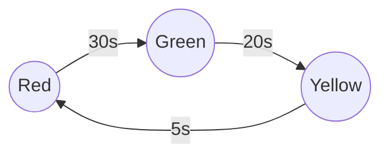

# Chapter 3: Design a Traffic Light Controller (မီးပွိုင့်စနစ်)

အေ သင်ခန်းစာမှာ ကျွန်တော်တို့ သင်ရိုးထဲမှာ မပါသိရေ **State Machine** ဆိုရေ Concept အသစ်ကို မိတ်ဆက်ပီးပါဖို့။ အေစာရေ Logic ကို စနစ်တကျ ထိန်းချုပ်ဖို့ အလွန်အသုံးဝင်ပါရေ။

---

## ၁။ လိုအပ်ချက်တိ (Requirements)
*   မီးပွိုင့်ရေ အနီ (Red)၊ အစိမ်း (Green)၊ အဝါ (Yellow) သုံးမျိုး ပြောင်းလဲရပါဖို့။
*   အစိုင်လိုက်ပြောင်းရဖို့: Red -> Green -> Yellow -> Red (Loop)။
*   အရောင်တစ်ခုစီအတွက် ကြာချိန် (Timer) သတ်မှတ်ထားရပါဖို့။

## ၂။ ဇာဖြစ်လို့ If-Else မလုံလောက်လဲ?
```text
IF red THEN go green
ELSE IF green THEN go yellow
...
```
အေပိုင်ရွီးကေ ရှုပ်ထွေးလားနိုင်ပါရေ။ စနစ်တစ်ခုက "အခြီအနီ" (State) တစ်ခုကနီ နောက်တစ်ခုကို ပြောင်းလဲစာဖြစ်လို့ **Finite State Machine (FSM)** ကို သုံးစွာ အကောင်းဆုံးပါ။

## ၃။ State Diagram
စက်ဝိုင်းပုံစံ လည်ပတ်နီပုံကို ပုံဖော်ကြည့်ပါ။



## ၄။ Logic Implementation (Pseudocode)

```text
STATE TrafficLight
    INITIAL_STATE = RED
    
    METHOD run()
        LOOP FOREVER
            CASE CURRENT_STATE OF
                RED:
                    TurnOn(RedLight)
                    WAIT 30 Seconds
                    CURRENT_STATE = GREEN
                    
                GREEN:
                    TurnOn(GreenLight)
                    WAIT 20 Seconds
                    CURRENT_STATE = YELLOW
                    
                YELLOW:
                    TurnOn(YellowLight)
                    WAIT 5 Seconds
                    CURRENT_STATE = RED
            END CASE
        END LOOP
    END METHOD
END STATE
```

---

## သင်ခန်းစာ အကျဉ်းချုပ်
- **State Machine**: စနစ်တစ်ခုဧ့ အခြီအနေတိ (States) နှင့် ပြောင်းလဲမှု (Transitions) ကို ထိန်းချုပ်ခြင်း။
- **Loop**: မီးပွိုင့်ပိုင် အဆုံးမရှိ လည်ပတ်နီရေ စနစ်တိမှာ သုံးခြင်း။

## လေ့ကျင့်ခန်း (Exercises)
1.  **Pedestrian Button**: လမ်းကူးလူက ခလုတ်ဖိလိုက်ကေ (Input) လက်ဟိဇာအရောင်ဖြစ်နီနီ မီးနီ (Red) ကို ချက်ချင်းပြောင်းချင်ရေ။ State Machine မှာ ဇာပိုင် Logic ထည့်ဖို့?
2.  **Emergency Mode**: Ambulanceကား လာကေ ခလုတ်တစ်ခု ဖိလိုက်စာနန့် မီးအားလုံး အနီဖြစ်လားပနာ တန့်လားရပါဖို့။ ယင့်စာကို State အသစ် တစ်ခုအနီနန့် ထည့်ဖို့လား၊ ဟိပြီးသား State တိကိုရာ ပြင်ဖို့လား?


 
